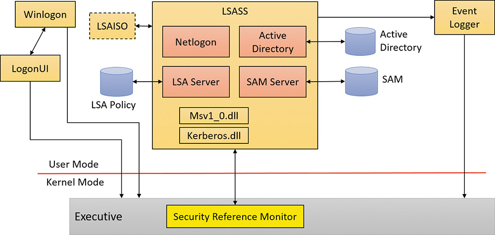
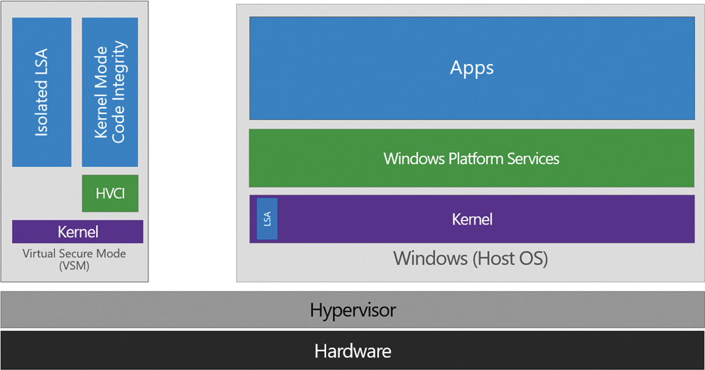
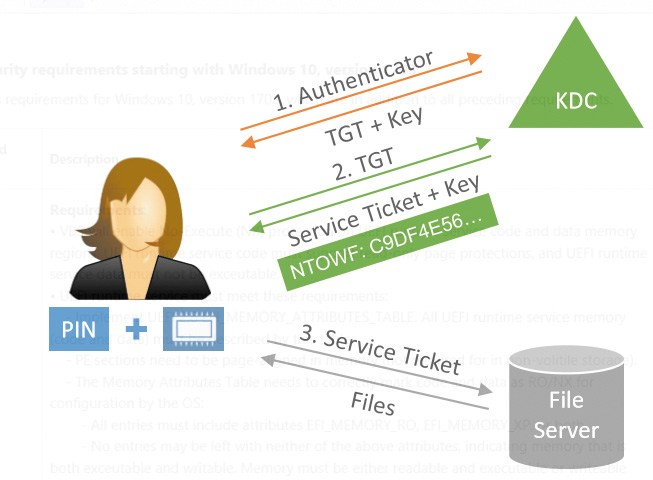
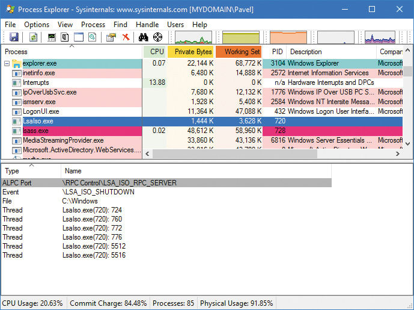
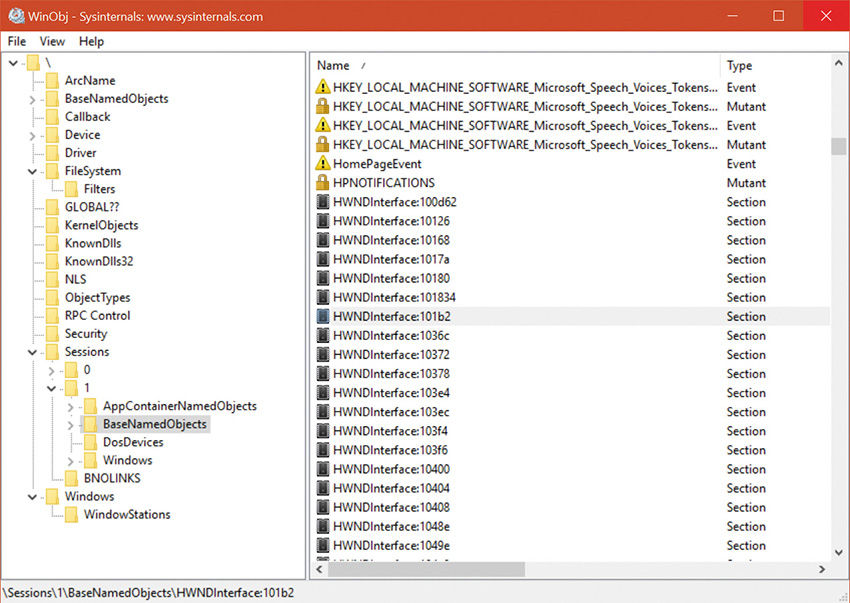
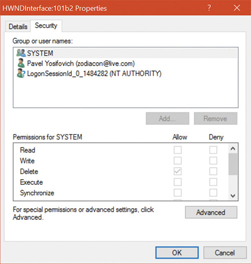

[TOC]

# Chapter7.安全

在任何有多个用户可以访问同一物理或网络资源的环境中，防止未经授权就访问敏感数据是十分重要的。操作系统以及个人用户必须能够保护文件、内存、配置设置不会受到不必要的查看和修改。操作系统安全包括浅显的层面，如账户、密码和文件保护。它还包括深层次的如保护操作系统不被损坏、防止低权限用户进行操作（例如重启计算机），以及不允许某一用户程序对其他用户或操作系统程序产生破坏。

 在这一章中，我们解释了Microsoft Widows的设计和实现的每一个方面是如何受到需要提供严格的安全性要求的影响的。

## 7.1 安全评级

根据明确的标准对软件以及操作系统进行评级，有助于政府、公司和个人用户保护存储在计算机中的专有和个人数据。目前美国和许多其他国家使用的安全评级标准是通用标准（Common Criteria(CC)）。然而要了解Windows中设计的安全功能，了解影响Windows设计的历史评估标准是很有用的：Trusted Computer System Evaluation Criteria（TCSEC）（可信计算机评估标准）。

### 7.1.1 Trusted Computer System Evaluation Criteria（可信计算机评估标准）

美国国家计算机安全中心（NCSC）成立于1981年，是美国国防部（DoD）国家安全局（NSA）的一部分。NCSC的一个目标是建立一系列的安全等级，列在表7-1中，表明了商业操作系统、网络组件和可信应用程序所提供的保护程度。这些安全等级可以在http://csrc.nist.gov/publications/history/dod85.pdf中查阅，它们在1983年被规定，通常被称为橙皮书。

| 等级 |     说明     |
| :--: | :----------: |
|  A1  |   验证设计   |
|  B3  |    安全域    |
|  B2  |  结构化保护  |
|  B1  | 标记安全保护 |
|  C2  | 访问控制保护 |
|  C1  | 任意访问保护 |
|  D   | 最小权限保护 |

​																		表7-1 TCSEC 评估等级

TCSEC标准由信任等级组成，较高的等级是在较低等级的基础上增加更严格的保护和验证要求而来的。目前没有操作系统符合A1等级。虽然由极个别的操作系统获得了B级之一，但目前认为C2级的安全保护是足够的，可以作为现阶段通用操作系统的最高评。

以下是C2安全评级的关键要求，它们仍然被认为是一个操作系统安全性的核心要求。

- **一个安全的登录设备(A secure logon facility)** 这要求用户有唯一的识别标志，而且必须在以某种方式验证后才允许用户访问计算机。
- **自由访问控制(Discretionary access control)** 这允许资源的所有者决定谁可以访问该资源以及可以对资源做什么。资源所有者授予权限，允许一组或多组用户对该资源进行访问、操作。
- **安全审计(Security auditing)** 这提供了检测和记录与安全相关的事件或创建、访问、或删除系统资源的任何尝试的能力。登录标识符记录所有的用户的身份，方便去溯源执行未经允许操作的用户。
- **目标重用保护(Object reuse protection)** 这样可以防止用户看到其他用户删除的数据，或者访问其他用户之前使用过然后释放的内存。例如，在某些操作系统中，可以创建一个一定长度的新文件，然后检查该文件的内容，以查看恰好占用了该文件在磁盘上分配的文件的数据。该数据可能是存储在其他用户文件中但已被删除的敏感的信息。对象重用保护通过将所有对象（包括文件和内存）分配给用户之前进行初始化来防止这个潜在的安全漏洞。

Windows还满足B级中的以下要求：

- **可信路径功能(Trusted path functionality)** 这样可以防止木马程序试图在用户登录时拦截用户账户和密码。Windows中的可信路径功能以```Ctrl+Alt+Delete``` logon-attention 序列的形式出现，非特权程序无法截获。这个按键序列也被称为安全注意序列（SAS），总是显示一个由系统控制的Windows安全屏幕（如果用户已经登录）或者登录屏幕，这样就可以很容易地识别潜在的木马。（如果组策略和其他限制允许，SAS也可以通过SendSAS API以编程形式发送）。当SAS被输入时，一个呈现虚假登录对话框的特洛伊木马将被绕过。      
- **可信设备管理(Trusted facility management)** 这需要支持管理功能的独立用户账户。例如，为管理员（Administrators）、负责备份计算机的用户账户和标准用户账户提供单独的账户。

Windows通过其安全子系统和相关组件满足了上述所有需求。

### 7.1.2 通用标准

### 7.1.3 安全系统组件

这些是实现Windows安全性的核心组件和数据库。（除非有特殊说明，所有提到的相关文件都在```%SystemRoot%\System32```目录下。）

- **安全引用监视器(Security reference monitor(SRM))** Windows可执行程序（Ntoskrnl.exe）中的这个组件负责定义访问token数据结构以表示安全上下文，对对象进行安全访问检查，操作权限（用户权限），并生成任何由此操作产生的安全审计信息。
- **本地安全认证子系统服务(Local Security Authority Subsystem Service(Lsass))**  这个用户模式下的进程运行```Lsass.exe```，它负责本地系统安全策略（如允许哪些用户登录到计算机，密码规则，授予用户组权限以及系统安全设计设置），用户身份验证，发送安全审计信息和日志。``Lsasrv.dll``是Lsass加载的一个实现上述大部分功能的一个库。
- **LSAlso.exe**  这被Lsass（如果在支持的Windows 10和Server 2016系统上如此配置）使用，也被称为Credential Guard（关于Credential Guard的更多信息，请参见即将出版的 "Credential Guard "部分），用来存储用户的token哈希值，而不是将它们保存在Lsass的内存中。因为Lsaiso.exe是一个运行在VTL 1中的Trustlet（隔离用户模式进程），没有任何正常的进程--甚至是正常的内核--可以访问到这个进程的地址空间。Lsass本身存储了一个加密的二进制文件，当它与Lsaiso（通过ALPC）通信时需要密码的哈希值。
- **Lsass策略数据库(Lsass policy database)** 这个数据库包含了本地系统的安全策略设置。它保存在注册表的``HKLM\SECURITY``下的ACL保护区中。它保存的信息有：请求哪些域来进程尝试登录验证，谁有权限访问系统以及如何访问（交互式、网络或服务形式登录），谁被授予了哪些权限，以及要执行什么样的安全检查。Lsass策略数据库还存储“秘密“，包括用于缓存域登录和Windows服务用户账户的登录信息。（关于Windows服务的更多信息，请参见 *Windows internals Part 2*第9章管理机制）。
- **安全性账户管理员(Security Accounts Manager(SAM))** 这个服务负责管理本地机器上创建的用户组的数据库。SAM服务在Samsrv.dll中实现，它会被加载到Lsass进程中。
- **SAM数据库(SAM database)**  这个数据库包含了定义在本地的用户组以及它们的密码和其他属性。在域控制器上，SAM不存储域定义的用户，但存储系统的管理员恢复账户和设置的密码。这个数据库存储在注册表的``HKLM\SAM``下。
- **活动目录(Active Directory)** 这是一个目录服务器，它包含一个数据库，存储着关于域中对象的信息。一个域是一个计算机及其相关组的集合，作为一个单一的实体进行管理。活动目录存储了关于域中对象的信息，包括用户组和计算机。域用户组的密码信息和权限存储在互动目录中，它被复制到被指定为域控制器的计算机上。活动目录服务器，以``Ntdsa.dll``的形式存在，在Lsass进程中运行。关于活动目录的更多信息，请参见*Part 2*第10章网络
- **交互式登录管理器(Interactive logon manager(Winlogon))**  这是一个运行在Winlogon.exe的用户模式进程负责响应SAS和管理交互式登录会话。例如，Winlogon在用户登录时创建第一个进程。
- **用户登录界面(Logon user interface(LogonUI))** 这是一个运行LogonUI.exe的用户模式进程，它向用户提供UI，用户可以使用它在系统上进行登录验证。LogonUI使用登录验证程序去检查用户登录凭据。
- **证书提供者(Credential providers(CPs))** 这些是在LogonUI进程中运行的进程内COM对象（在执行SAS时由WInlogon按需启动），用于获取用户名和密码、智能卡PIN、生物特征数据 （如指纹）或其他识别机制。标准的CPs是由``authui.dll、SmartcardCredentialProvider.dll、biocredproof.dll`` 和``FaceCredentialProvider.dll``，后者是在Windows 10中增加的面部检测。
- **网络登录服务(Network logon service(Netlogon))** 这是一个Windows服务（Netlogon.dll托管在一个标准SvcHost中），它设置了一个到域控制器的安全通道，通过该通道发送安全请求，如交互式登录（如果域控制器运动Windows NT 4）或LAN Manager和NT LAN Manager（v1和v2）的认证确认。Netlogon也被用于活动目录的登录。
- **内核安全设备驱动程序(Kernel Security Device Driver(KSecDD))** 这是一个内核模式下的链接库（``%SystemRoot%\System32\Driver\Ksecdd.sys``），函数实现本地高级过程调用（ALPC）接口，其他内核模式安全组件（包括加密文件系统（EFS））使用该接口与在用户模式下的Lsass进行通信。
- **应用程序控制策略（Applocker）** 这种机制允许管理员指定哪些可执行文件、链接库和脚本可以被指定的用户组使用。Applocker由一个驱动器（``%SystemRoot%\System32\Drivers\Appld.sys``）和一个服务（AppldSVC.dll）组成，在一个标准的SvcHost进程中运行。

图7-1显示了其中一些组件和它们所管理的数据库之间的关系



图7-1 Widnows security components

运行在内核模式下的SRM和运行在用户模式下的Lsass使用*Part 2*第八章“系统机制”中描述的ALPC设备进行通信。在系统初始化期间，SRM创建了一个名为``` SeRmCommandPort```端口。SRM连接到这个端口，将会创建私有通信端口。SRM将会给超过256字节的信息创建一个共享内存区域，在连接调用中创建一个句柄。一旦SRM和Lsass在系统初始化期间相互连接，它们就不再监听各自连接的端口。因此，后来的用户进程没有办法为了恶意目的成功地连接到这些端口中的任意一个。连接请求将永远不会完成。

## 7.2 基于虚拟化的安全(Virtualization-based security)

由于内核本身具有最高的权限，并且与用户模式的应用程序隔离，因此通常将内核称为*可信的*。然而，微软曾表示每个月都有无数的第三方驱动被编写出来。每个月通过远程可以看到的独特驱动哈希值有一百。这些驱动可能包含任意数量的漏洞，更不用说含有恶意目的的内核模式代码。在这样的一个真实环境中，内核是一个小的、受保护的组件，而用户模式的应用程序时“安全的”，不受攻击的，这种想法显然是无法实现的。这种情况下导致人们无法完全信任内核，并使关键 的用户程序（可能包含高度隐私的用户数据）被其他恶意用户程序或恶意的内核程序所破坏。

正如第二章“系统架构”中所讨论的那样，Windows 10和Server 2016包括一个基于虚拟化的安全（VBS）架构，可以实现额外的正交信任层：虚拟信任层（VTL）。在本节中，你将看到Credential GUard和Device Guard如何利用VTL来保护用户数据，并为数据代码签名提供额外的基于硬件信任的安全层。在本章的最后，你还会看到内核补丁保护（KPP）是如何通过PatchGuard组件提供的，并通过VBS支持的HyperGuard技术来加强。

需要注意的是，正常的用户模式和内核代码在VTL 0中运行，并不知道VTL 1的存在。这意味着在VTL 1中的任何东西 都是隐藏的，VTL 0代码是无法访问到的。如果恶意软件能够穿透正常的内核，但它仍然不能获得存储在VTL 1中的任何东西，甚至是VTL 1中运行的用户模式代码（这被称为隔离用户模式）。图7-2显示了我们在本节中要看到的主要VBS组件。

- 基于Hypervisor的代码完整性（HVCI）和内核模式代码完整性（KMCI）它们为Device Guard提供支持
- LSA（Lsass.exe）和隔离的LSA（Lsalso.exe），为Credential Guard提供支持

此外，请回想一下，第三章中在IUM中运行的Trustlets的实现



图7-2 VBS components

当然，与任何受信任的组件一样，VTL也假定它所依赖的组件是可信的。因此，VTL 1需要安全启动（以及固件）才能正常运行，Hypervisor必须没有被破坏，硬件设施（如IOMMU和Intel  Management Engine必须没有VTlL 0可访问的漏洞。有关信任和引导相关的安全技术更多信息，请参见第二部分中第十一章”启动和关闭“。

### 7.2.1 凭据保护（Credential Guard）

要了解Credential Guard提供的安全边界和保护，最重要的是要了解在网络环境中提供访问用户资源和数据或者登录功能的各种组件：

- **密码（Password）** 这是交互式用户用于在机器上标识自己的主要凭据。此凭据用于身份验证，并派生凭据模型的其他组件。它是用户身份中最受追捧的部分。
- **NT 单向函数（NT one-way function(NT OWF))** 这是旧组件使用NT LAN Manager（NTLM）协议来标识用户（使用密码成功登录后）的哈希值。虽然现代网络系统不再使用NTLM对用户进行身份的验证，但许多本地组件仍在使用，某些类型的传统网络组件（例如基于NTLM的身份验证代理）也是如此。由于NTOWF是MD4散列，在当今的复杂硬件环境下，其算法缺乏抗重复性保护，意味着拦截到散列就会可以造成泄露，甚至有可能恢复密码。
- **票据授予票据（Ticket-granting ticker(TGT))** 当使用更现代的远程身份验证机制：Kerberos时，这相当于NTOWF。这是基于WIndows Active directory的域的默认设置，并在Sercer 2016上强制执行。成功登录后，TGT和相应的密钥会提供给本机计算机（就像NTLM上的NTOWF一样）。拦截这两个组件会立即破环用户凭据，但是无法重用和恢复密码。

在没有启动Credential Guard的情况下，用户的认证凭据和一些或者所有这些组件都存在于Lsass的内存中。

------

💬Note

要在Widnows 10 Enterprise和Server 2016版本中启用凭据保护功能，请打开组策略编辑器（gpedit.msc），选择”计算机配置“，选择”管理模板“，选择”系统“，选择”设备保护“，选择”打开基于虚拟化的安全“。在出现的对话框的左上角，选择Enable。最后，在Credential Guard Configuration组合框中选择Enable选项。

#### 7.2.1.1 密码保护（Protecting the password）

使用本地对称密钥加密的密码存储后可通过摘要式身份验证（WDigest，自Windows XP起用于基于HTTP的身份验证）或终端服务/RDP等协议提供单点登录（SSO）功能。由于这些协议使用明文身份验证，密码必须保存在内存中，然后可以通过代码注入、调试器或其他漏洞利用技术访问并解密。Credential Guard无法改变这些本质上不安全的协议。因此，Credential Guard采用的唯一可能的解决方案是禁用此类协议的SSO功能。这会导致兼容性丢失并强制用户重新进行身份验证。

显然，一个更好的解决方案是完全取消密码的使用，本章后面的”Windows Hello“部分所描述的Windows Hello就允许这样做。使用生物特征（如用户的脸部或指纹）进行认证，就不需要再输入密码，从而保证了交互式凭证对硬件键盘记录器、内核嗅探/勾选工具和基于用户模式的欺骗应用程序的安全。如果用户从来不需要输入密码，就没有密码可偷。另一个类似的安全凭证是智能卡和相关PIN码的组合。虽然PIN码在输入时可能被盗，但智能卡是一个物理元素，如果没有复杂的基于硬件的攻击，其密钥是无法被截获的。这是一种双因素认证（TFA），其中有许多其他的实现方式。

#### 7.2.1.2 保护NTOWF/TGT密钥（Secure communication）

即使使用受保护的交互凭证，成功登录也会导致域控制器的密钥分发中心（KDC）返回TGT及其密钥，以及遗留应用程序的NTOWF。之后，用户只需要使用NTOWF来访问遗留资源，并使用TGT及其密钥生成服务凭证。然后可以使用它来访问远程资源（例如共享中的文件），如图7-3所示。



图7-3 Accessing remote resources

因此，如果NTOWF或TGT及其密钥（存储在Lsass中）在攻击者手中，即使没有智能卡、PIN码、或用户的脸部特征或指纹，也可以访问资源。因此，保护Lsass不受攻击者的访问是一种可行的选择，并且可以使用第三章中描述的Protected Process Light（PPL）体系结构来实现。

Lsass可以通过将``HKLM\System\CurrentControlSet\Consol\Lsa`` 注册表项中的``DWORD``值``RunAsPPL``设置为1，可以将Lsass配置为受保护运行 ，（这不是默认选项，因为合法的第三方身份验证提供程序[DLL]加载并执行在Lsass的上下文中，如果Lsass运行受保护，这是不可能的。）不幸的是，虽然这种保护确实保护了NTOWF和TGT密钥免受用户模式攻击者的攻击，但它并不能防止内核攻击或每月生成 的数百万个驱动程序中任何一个中漏洞。Credential Guard通过使用另一个进程Lsaiso.exe解决了这个问题，该进程在VTL 1中作为Trustlet运行。因此，该进程将用户的机密存储在内存中，而不是Lsass中。

#### 7.2.1.3 安全通信

如第2章所示，VTL 1具有最小的攻击面，因为他没有完整的常规”NT“内核，也没有任何驱动程序或对任何类型硬件的I/O访问。因此，被隔离LSA作为VTL 1Trustlet，不能与KDC直接通信。这仍然是Lsass进程的责任，它充当代理和协议实现者，与KDC通信以验证用户并接收TGT和密钥及NTOWF，以及通过使用服务凭证与文件服务器通信。这似乎导致了一个问题：TGT和它的密钥/NTOWF在身份认证期间暂时通过Lsass，并且TGT和它的密钥在某种程度上对Lsass可用来生成服务票据。这就导致了两个问题：Lsass如何从孤立的ISA发送和接收机密信息，以及我们如何防止攻击者做同样的事情？

要回答第一个问题，请回忆第三章”进程和作业“，其中描述了哪些服务对Trustlet可用。一个是高级本地过程调用（ALPC），安全内核通过将NtAloc*调用代理到普通内核来支持它。然后，隔离用户模式环境，通过ALPC协议实现对RPC运行时库（Rpcrt4.dll）的支持，这允许VTL 0和VTL 1应用程序使用本地RPC通信，就想任何其他应用程序和服务一样。在图7-4Proces Explore中，可以看到Lsalso.exe进程，该进程有一个LSA_ISO_RPC_SERVER ALPC端口的句柄。用于与Lsass.exe进程通信。（有关ALPC的更多信息，请参阅第二部分第八章）



图7-4 Lsalso.exe and its ALPC port

要回答第二个问题，需要对加密协议和挑战/应答模型有所了解。如果你已经熟悉SSL/TLS技术的一些基本概念及其在internet通信中防止中间人（MitM）攻击的用途，那么你可以以类似的方式考虑KDC和隔离的LSA协议。虽然Lsass像代理一样位于中间层，但它只能看到KDC和隔离的LSA之间的加密通信，不能解密其内容。因为隔离的LSA建立了一个只存在于VTL 1中的本地”会话密钥“，然后使用一个安全协议发送这个会话密钥，这个会话密钥用另一个只有KDC拥有的密钥加密，然后KDC可以在用隔离的LSA会话密钥进行加密后，用TGT及其密钥进行响应。因此，Lsass看到的是一个给KDC的加密信息（不能被解密）和一个来自KDC的加密信息（不能被解密）。

这个模型甚至可以用来保护基于挑战/响应模型的传统NTLM身份验证。例如，当用户使用明文凭证登录时，LSA将其发送给隔离的LSA，由隔离的LSA使用会话密钥对其进行加密，并将加密后的凭证返回给Lsass将NTLM挑战和之前加密的凭证发送到隔离的LSA。此时，只有隔离的LSA拥有加密密钥，因此它对凭据进行解密，并根据挑战生成一个NTLM响应。

然而，请注意，在这个模型中存在四种可能的攻击：

- 如果机器已经在物理上被攻破，明文密码可以在输入或发送到隔离的LSA时被截获（如果Lsass已经被攻破）。使用Windows Hello可以缓解这种情况。
- 如前所述，NTLM没有防重放特性。因此，如果捕获了NTLM响应，则可以对相同的挑战重新播放它。或者，如果攻击者可以在登录后破坏Lsass，那么它可以捕获加密的凭据并强制隔离的LSA为任意的NTLM挑战生成新的NTLM响应。然而，这种攻击只能在重新启动之前生效，因为隔离的LSA在重新启动时会生成新的会话密码。
- 在kerberos登录的情况下，可以拦截NTOWF（未加密），然后重用它，就像标准的传递散列攻击一样。然而，这同样需要一台已经被破坏的机器（或物理网络拦截）。
- 具有物理访问权限的用户可能能够禁用Credential Guard。在这种情况下，将使用传统的身份验证模型（所谓的”降维攻击“），现在可以采用旧的攻击模型。

#### 7.2.1.4 UEFI lock

因为禁用Credential Guard（它最终不过是一个注册表设置）对攻击者来说是微不足道的，所以可以利用Secure Boot和UEFI来防止非物理存在的管理员（比如具有管理员权限的恶意软件）禁用Credential Guard。这是通过启用凭据保护和UEFI锁实现的。在这种模式下，一个EFI运行时变量被写入固件内存，并且需要重新启动。在重新启动时，Windows引导加载程序（仍然在EFI引导服务模式下允许）将写入一个EFI引导变量（一旦退出EFI引导服务模式，该变量具有不可读或不可写的属性），以记录Credential Guard被启用的事实。此外，将记录引导配置数据库（BCD）选项。

当内核引导时，它将在存在BCD选项和（或）UEFI运行时变量的情况下自动重写所需的Credential Guard注册表键。如果BCD选项被攻击者删除，BitLocker（如果启用）和基于TPM的远程验证（如果启用）将检测到该变换，并要求在启动前物理输入管理员的恢复密钥，然后根据UEFI运行时间变量恢复BCD选项。如果UEFI运行时变量被删除，Windows启动加载器将根据UEFI启动变量来恢复它。因此，如果没有特殊的代码来删除UEFI启动变量--这只能在EFI启动服务·模式下进行—就没有办法在UEFI锁定模式下禁用Credential Guard。

唯一存在的此类代码位于称为SecComp.efi的特殊Microsoft二进制文件中。这必须由管理员下载，然后管理员必须从备用的基于EFI的设备启动计算机并手动执行它（需要BitLocker恢复密钥以及物理访问）或修改BCD（需要BitLocker恢复密钥）。在重新启动时，SecComp.efi将需要用户在UEFI模式下确认（只能由物理用户完成）。

#### 7.2.1.5 身份验证策略和 armored Kerberos

使用”安全，除非在登录前已经被攻破或物理管理员攻破“的安全模式，无疑是对传统的非基于凭证保护的安全模式的改进。然而，一些企业和组织可能希望得到更强大的安全保证：即使是被破坏的机器也不能用来伪造或重放用户凭证。而去如果用户的凭证已经被破坏，也不能在特定系统之外使用。通过利用名为”认证策略“的Server 2016功能和 **armored Kerberos**，Credential Guard可以在这种高度安全的模式下运行。

在这种模式下，VTL 1安全内核将使用TPM（也可以使用磁盘上的文件，但其将失去安全性的意义）收集一个特殊的机器ID密钥。此密钥随后用于在初始域加入操作期间生成TGT密钥，因为机器已经设置（很明显，确保机器在配置期间处于受信任状态很重要），并将此TGT密钥发送到KDC，配置完成后，当用户使用其他人的凭据登录时，它会与机器凭据（只有隔离的LSA可以访问）结合，形成一个来源证明密钥。KDC将在使用来源证明密钥对其进行加密，回复NTOWF和用户TGT机器密钥。在这种模式下，提供了两个安全保障：

- 用户正在从已知的机器进行身份验证如果用户或攻击者拥有原始凭据，并尝试在不同的机器上使用它们，则基于TPM的机器凭据将有所不同。
- NTLM响应/用户票据来自隔离的LSA，并不是Lsass自动生成的。这保证了Credential Guard在机器上是启用的，即使物理用户可以以某种方式禁用它。

不幸的是，如果机器以这样的一种方式被破坏，即包含用户TGT及其密钥的来源证明加密KDC响应被拦截，则可以将其存储起来，并用于从隔离的LSA请求会话密钥加密的服务凭证。然后可以将它发送到文件服务器来访问它，直到发出重新启动以擦除会话密钥。因此，在使用Credential Guard的系统上，建议用户在每次注销时重新启动。否则，攻击者甚至可以在用户不再存在后获取到有效凭证。

#### 7.2.1.6 未来的改进

正如第二章和第三章所讨论的，VTL 1中的安全内核目前正在进行改进，以添加对PCI和USB硬件的特殊的支持，这些硬件只能通过管理程序和使用安全设备框架（SDF）的VTL 1代码进行通信。结合Biolso.exe和Fslso,exe，这是新的Trustlets，可以安全地获取生物数据和视频帧（从网络摄像头），基于VTL 0内核模式的组件不能拦截Windows Hello身份验证尝试的内容（与用户的明文密码相比，我们认为这是安全的，但仍然可以通过基于自定义驱动的拦截在技术上捕获）。一旦发布，Windows Hello凭证将被保护在硬件级别上永远不可用于VTL 0。在这种模式下，Lass将不需要参与Windows Hello身份验证。被隔离的LSA将直接从被隔离的生物特征或被隔离的帧服务获得凭证。

------

💬Note

安全驱动框架SDF（Secure Driver Framework）是相当于wdf的VTL 1驱动。此框架目前是不公开的，但仅在创建VTL 1驱动程序时与MIcrosoft合作伙伴共享。

------

7.2.2 设备保护（Device Guard）

虽然Credential Guard关注的是保护用户的凭证，但Device Guard有一个完全不同的目标：保护用户的机器本身免受不同类型的基于软件和硬件的攻击。Device Guard利用Windows代码完整性服务，如内核模式代码签名（KMCS）和用户模式代码完整性（UMCI），并通过HyperVisor代码完整性（HVCI）加强它们。（有关代码完整性的更多信息，请参阅第二部分的第八章）

此外，Device Guard是完全可配置的，这是得益于自定义代码完整性（CCI）和签名策略，这些策略由安全引导（Secure Boot）保护并由企业管理员定义。这些策略（在第八章中进行了解释）运行执行基于加密声音信息（如证书签名者或SHA-2散列）的包含/排除列表，而不是像AppLocker的策略那样基于文件路径或文件名。

因此，虽然我们不会在此处描述定义和自定义代码完整性策略的不同方式，但我们将展示Device Guard如何通过以下方式来保证强制执行这些策略的任何设置：、

- 如果强制执行内核模式代码签名，则只有签名的代码才能加载，而不管内核本身是否被破坏。这是因为内核加载过程将在加载驱动程序时通知VTL 1中的安全内核，并且只有在HVCi验证之后才会成功加载。
- 如果强制执行内核模式代码签名，则签名代码一旦加载就无法修改，即使是内核本身也是如此。这是因为可执行代码页将通过管理程序的二级地址转换（SLAT）机制标记为只读，这将在第二部分的第八章中进一步解释。
- 如果强制执行内核模式代码签名，则禁止动态分配代码。这是因为内核没有能力在SLAT页表项中分配可执行项，即使内核页表本身会将此类代码标记为可执行。
- 如果强制执行内核模式代码签名，则无法修改UEFI运行时代码，即使是其其他UEFI运行时代码或内核本身。另外，在加载代码时，Secure Boot应该已经验证了该代码是否已签名。（Device Guard依赖于这个）。此外，UEFI运行时数据无法执行。这是通过读取所有UEFI运行时代码和数据，强制执行正确的权限并将它们复制到SLAT页表项中来完成的，这些项在VTL 1中受到保护。

- 如果强制内核模式代码签名，则只能执行内核模式(0环)签名的代码。这可能再次听起来像前三个要点的重复，但是考虑带符号的3环代码。从``UMCI``的角度来看，这样的代码是有效的，并且已经被授权作为``SLAT``页表项中的可执行代码。安全内核依赖于基于模式的执行控制(``MBEC``)特性(如果存在于硬件中)，它用一个用户/内核可执行位来增强SLAT，或者管理程序对这个功能的软件模拟，称为受限用户模式（``RUM``）。
- 如果用户模式代码签名被强制执行，那么只有经过签名的用户模式图像可以被加载 。这意味着所有可执行进程必须是有签名的（``.exe``）文件，以及它们所加载的库（``.dll``）。
- 如果强制执行用户模式代码签名，则内核不允许用户模式应用程序使现有的可执行代码页可写。显然，用户模式代码不可能在不征得内核许可的情况下分配可执行内存或修改现有内存。因此，内核可以应用其通常的强制规则。但即便是在内核受损的情况下，``SLAT``也能确保在没有内核允许的情况下，用户模式的页面都无法执行，且此类可执行页面也无法写入。
- 如果强制执行用户模式代码签名，并且签名策略要求硬编码保证，则禁止动态分配代码。这是与内核场景的一个重要区别。默认情况下，允许用户模式签名代码分配额外的可执行内存来支持``JIT``场景，除非在应用程序的证书中存在特殊的增强密钥使用(``EKU``)，它作为动态代码来生成授权。目前，``NGEN.EXE``(``.NET``本机映像生成)有这个``EKU``，即使在这种模式下也允许``IL-only .NET``可执行文件运行。
- 如果强制使用用户模式``PowerShell``约束的语言模式，所有使用动态类型、反射或其他语言特性的``PowerShell``脚本都允许执行任意代码或编码到``Windows/.NET API``中的函数也必须签名。这可以防止恶意的PowerShell脚本不受约束。

``SLAT``页表项在 VTL 1 中受到保护，并包含给定内存页面可以具有哪些权限的“基本事实”。通过根据需要保留可执行位，或保留现有可执行页面中的可写位，``Device Guard`` 将所有代码签名强制移入 VTL 1（在 一个名为 ``SKCI.DLL`` 中，或者在内核安全代码完整性的库中）。

此外，即使未在计算机上明确配置，如果通过强制所有`` Trustlet`` 具有特定 ``Microsoft`` 签名以及包含独立用户模式 EKU 的证书来启用 ``Credential Guard``，``Device Guard``也会在第三种模式下运行。 否则，具有``ring 0``权限的攻击者可以攻击常规``KMCS``机制并加载恶意 ``Trustlet`` 来攻击隔离的 LSA 组件。 此外，所有用户模式代码签名强制措施对于``Trustlet``都是有效的，它在硬编码保护模式下执行。

最后，作为性能优化，重要的是要理解，当系统从休眠状态(S4休眠状态)恢复时，``HVCI``机制不会重新验证每个页面。在某些情况下，证书数据甚至可能不可用。即使是这种情况，也必须重新构建``SLAT``数据，这意味着``SLAT``页表条目存储在休眠文件本身中。因此，系统管理程序需要相信休眠文件没有以任何方式被修改。这是通过使用存储在``TPM``中的本地机器密钥加密休眠文件来实现的。不幸的是，在没有``TPM``的情况下，这个密钥必须存储在``UEFI``运行时变量中，这允许本地攻击者解密休眠文件、修改它并重新加密它。

## 7.3 对象保护(Protecting objects)

对象保护和访问日志是自由访问控制和审计的本质。在Windows上可以被保护的对象包括文件、设备、邮件槽、管道(命名和匿名)、作业、进程、线程、事件、键控事件、事件对、互斥、信号量、共享内存部分、I/O完成端口、LPC端口、可等待计时器、访问令牌、卷、窗口站、桌面、网络共享、服务、注册表项、打印机、Active Directory对象等等——理论上讲，都是由执行对象管理器管理的。在实践中，不暴露于用户模式的对象(如驱动程序对象)通常不受保护。内核模式代码是受信任的，通常使用对象管理器的接口，不执行访问检查。由于导出到用户模式(因此需要安全验证)的系统资源是作为内核模式下的对象实现的，因此Windows对象管理器在加强对象安全性方面起着关键作用。

可以使用``WinObj Sysinternals``工具查看保护对象(命名对象)，如图7-5所示。用户会话中的``section``对象的``Security``属性页面如图7-6所示。虽然文件是最常与对象保护关联的资源，但Windows对执行对象使用与文件系统中的文件相同的安全模型和机制。就访问控制而言，执行对象与文件的区别仅在于每种类型对象支持的访问方法不同。



图7-5 WinObj with a section object selected



图7-6 An exective object and its security descriptor , viewed by WinObj

 如图7-6所示，实际是对象的自由访问控制列表(``discretionary access control list, DACL``)。我们将在“安全描述符和访问控制”一节中详细描述``DACL``。

可以使用`Process Explorer`通过双击下方窗格视图中的句柄(当配置为显示句柄时)来查看对象的安全属性。这样做还有一个额外的好处，就是可以显示未命名的对象。在这两个工具中显示的`Property`页面是相同的，因为页面本身是由Windows提供的。

为了控制谁可以操作一个对象，安全系统必须首先确定每个用户的身份。这需要保证用户的身份，这就是Windows在访问任何系统资源之前需要经过身份验证的原因。当一个进程请求一个对象的句柄时，对象管理器和安全系统使用调用者的安全标识和对象的安全描述符来确定是否应该给调用者分配一个句柄，以授权进程访问到它想要的对象。

正如本章后面所讨论的，线程可以采用与其进程不同的安全上下文。这种机制称为模拟。当一个线程正在模拟时，安全验证机制使用线程的安全上下文而不是线程所属进程的安全上下文。当线程不进行模拟时，安全性验证依赖于使用线程所属进程的安全上下文。一定要记住，一个进程中的所有线程共享同一个句柄表，因此当一个线程打开一个对象(即使它是模拟的)时，该进程中的所有线程都可以访问该对象。

有时，验证用户的身份不足以让系统授予该帐户获得可以访问的资源访问权。从逻辑上讲，这可以清楚地区分在`Alice`帐户下运行的服务和`Alice`在浏览Internet时下载的未知应用程序。Windows通过Windows完整性机制实现了这种用户内部隔离，该机制实现了完整性级别。Windows完整性机制被用户帐户控制(`UAC`)提升、用户界面特权隔离(`UIPI`)和`Appcontainers`所使用，这些将在本章的后面进行描述。

### 7.3.1 访问检查(Access checks)

Windows安全模型要求线程在打开对象时预先指定要在对象上执行什么类型的操作。对象管理器调用`SRM`，根据线程所需的访问执行访问检查。如果授予了访问权限，则为线程所属进程分配一个句柄，线程(或进程中的其他线程)可以使用该句柄对对象执行进一步的操作。

导致对象管理器执行安全访问验证的一个事件是线程使用名称打开现有对象时。当按名称打开对象时，对象管理器在对象管理器名称空间中执行指定对象的查找。如果对象不在辅助名称空间中，例如配置管理器的注册表名称空间或文件系统驱动程序的文件系统名称空间，则对象管理器一旦定位到对象，就调用内部函数`ObpCreateHandle`。顾名思义，`ObpCreateHandle`在进程句柄表中创建一个与对象相关联的条目。`ObpCreateHandle`首先调用`ObpGrantAccess`来查看线程是否有访问对象的权限。如果是，`ObpCreateHandle`调用执行函数，在进程句柄表中创建条目。`ObpGrantAccess`调用`ObCheckObjectAccess`，发起安全访问检查。

`ObpGrantAccess`向`ObCheckObjectAccess`传递打开对象的线程的安全凭证、线程正在请求的对象的访问类型(读、写、删除等等，包括特定于对象的操作)以及对象的指针。`ObCheckObjectAccess`首先锁定对象的安全描述符和线程的安全上下文。对象安全锁防止系统中的其他线程在进行访问检查时更改对象的安全性。线程安全上下文上的锁阻止另一个线程(来自该进程或其他进程)在进行安全验证时更改线程的安全标识。然后，`ObCheckObjectAccess`调用对象的安全方法来获取对象的安全设置。(关于对象方法的描述，请参阅第2部分的第8章。)对安全方法的调用可能会调用不同执行组件中的函数。但是，许多执行对象依赖于系统默认的安全管理支持。

定义对象的执行组件不希望覆盖`SRM`的默认安全策略时，它将对象类型标记为具有默认安全。每当`SRM`调用对象的安全性函数时，它首先检查对象是否具有默认安全性。具有默认安全性的对象将其安全信息存储在其头部，其安全函数是`SeDefaultObjectMethod`。不依赖于默认安全性的对象必须管理自己的安全性信息并提供特定的安全性函数。依赖于默认安全性的对象包括互斥、事件和信号量。文件对象是覆盖默认安全性的对象的一个例子。I/O管理器定义了文件对象类型，它拥有文件所在的文件系统驱动程序来管理(或选择不实现)其文件的安全性。因此，当系统查询表示NTFS卷上文件的文件对象的安全性时，I/O管理器文件对象安全性函数使用NTFS文件系统驱动程序检索文件的安全性。但是请注意，打开文件时不会执行`ObCheckObjectAccess`，因为它们驻留在辅助名称空间中。只有当线程显式地查询或设置文件的安全性时(例如使用Windows的`SetFileSecurity`或`GetFileSecurity`函数)，系统才会调用文件对象的安全性函数。

`ObCheckObjectAccess`获取对象的安全信息后，调用SRM函数`SeAccessCheck`。`SeAccessCheck`是Windows安全模型的核心功能之一。`SeAccessCheck`接受的输入参数包括对象的安全信息、被`ObCheckObjectAccess`捕获的线程的安全标识，以及线程正在请求的访问。`SeAccessCheck`返回true或false，这取决于线程是否被允许访问它请求的对象。

下面是一个例子:假设一个线程想知道某个特定进程何时退出(或以某种方式终止)。它需要处理到目标进程通过调用`OpenProcess` API,传入两个重要参数:独特的进程ID(假设是已知或已经以某种方式获得)和一个访问掩码指示线程想要执行的操作使用返回的句柄。比较懒的开发人员可能只是传递`PROCESS_ALL_ACCESS`作为访问掩码，指定他们想要进程的所有可能的访问权限。会出现以下两种结果之一:

