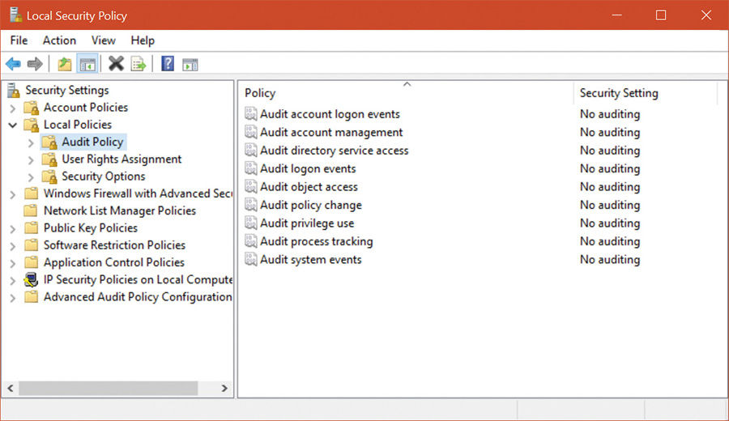
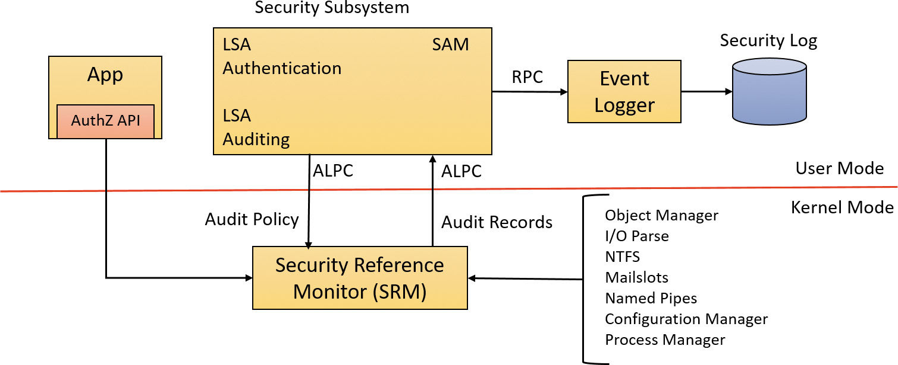
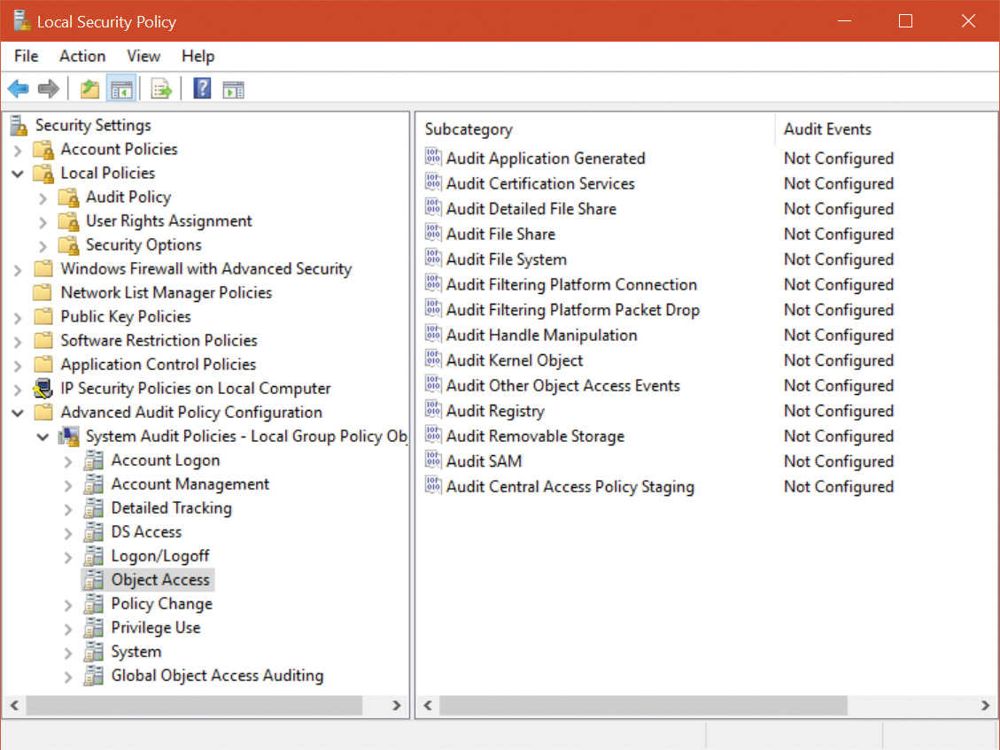

## 7.6 安全审计(Security auditing)

对象管理器可以生成审计事件作为访问检查的结果，用户应用程序可用的Windows函数可以直接生成它们。始终允许内核模式代码生成审计事件。两个权限，`SeSecurityPrivilege`和`SeAuditPrivilege`，与审计相关。进程必须具有`SeSecurityPrivilege`权限来管理安全事件日志和查看或设置对象的SACL。但是，调用审计系统服务的流程必须具有`SeAuditPrivilege`特权才能成功生成审计记录。

本地系统的审计策略控制审计特定类型的安全事件的决定。审计策略也称为本地安全策略，是lass在本地系统上维护的安全策略的一部分。配置“本地安全策略”编辑器，如图7-13所示。审计策略配置(本地策略和高级审计策略配置中的基本设置)以位图值存储在注册表中

`HKEY_LOCAL_MACHINE\SECURITY\Policy\PolAdtEv key.`

图7-13 Local Security Policy editor audit policy configuration

在系统初始化时，当审计策略发生变化时，`Lsass`向SRM发送审计策略消息。`Lsass`负责从SRM接收审计事件生成的审计记录，编辑审计记录，并将审计记录发送给事件记录器。`Lsass`(而不是SRM)发送这些记录，因为它添加了相关的细节，比如更完整地标识正在审计的进程所需的信息。

SRM通过ALPC连接向`Lsass`发送审计记录。然后，事件日志记录器将审计记录写入安全事件日志。除了SRM通过的审计记录之外，`Lsass`和SAM都生成审计记录，`Lsass`直接将这些审计记录发送给事件记录器，`AuthZ APIs`允许应用程序生成应用程序定义的审计。总体流程如图7-14所示。

图7-14 Flow of security audit records.

审计记录在接收到的时候被放到队列中发送给LSA。它们不是分批提交的。审计记录通过两种方式之一从SRM移动到安全子系统。如果审计记录很小(小于ALPC消息的最大大小)，则以ALPC消息的形式发送。审计记录从SRM的地址空间拷贝到Lsass进程的地址空间。如果审计记录很大，SRM使用共享内存使消息对Lsass可用，并简单地在ALPC消息中传递一个指针。

### 7.6.1 对象访问审计(Object access auditing)

在许多环境中，审计机制的一个重要用途是维护对受保护对象(特别是文件)的访问日志。为此，必须启用“审计对象访问策略”，并且在系统访问控制列表中必须有审计`ACEs`启用审计对象。

当访问器尝试打开一个对象的句柄时，SRM首先确定是允许还是拒绝这种尝试。如果开启对象访问审计功能，则SRM将扫描该对象的系统ACL。审计ace有两种类型:允许访问和拒绝访问。审计ACE必须匹配访问器持有的任何安全id，它必须匹配请求的任何访问方法，并且它的类型(允许访问或拒绝访问)必须匹配访问检查的结果，以生成对象访问审计记录。

对象访问审计记录不仅包括允许或拒绝访问的事实，还包括成功或失败的原因。这种“访问原因”报告通常采用访问控制项的形式，在审计记录中在安全描述符定义语言(`Security Descriptor Definition Language`, `SDDL`)中指定。这允许通过识别导致尝试访问成功或失败的特定访问控制条目，诊断您认为应该拒绝访问的对象被允许或相反的情况。
如图7-13所示，缺省情况下，对象访问审计功能为关闭状态(其他审计策略也是关闭状态)。

### 7.6.2 全局审计策略(Global audit policy)

除了对单个对象进行对象访问`ACEs`之外，还可以为系统定义全局审计策略，该策略支持对所有文件系统对象、所有注册表项或两者进行对象访问审计。因此，安全审计人员可以确定将执行所需的审计，而不必设置或检查所有感兴趣的单个对象上的`SACLs`。

管理员可以通过带`/resourceSACL`选项的`AuditPol`命令设置或查询全局审计策略。这也可以通过调用`AuditSetGlobalSacl`和`AuditQueryGlobalSacl API`以编程方式实现。与更改对象的`SACLs`一样，更改这些全局`SACLs`需要`SeSecurityPrivilege`。

全局审计策略以`HKLM\SECURITY\ policy \GlobalSaclNameFile`和`HKLM\SECURITY\ policy \GlobalSaclNameKey`中的一对系统访问控制列表的形式存储在注册表中。您可以通过在System帐户下运行`Regedit.exe`检查这些密钥，如本章前面“安全系统组件”一节所述。在设置了至少一次相应的全局`SACLs`之后，这些键才会存在。

全局审计策略不能被对象上的`SACL`覆盖，但特定于对象的`SACLs`可以允许进行额外的审计。例如，全局审计策略可能需要对所有用户对所有文件的读访问进行审计，但是对单个文件的`SACLs`可以添加对特定用户或更特定的用户组对这些文件的写访问的审计。

还可以通过下一节介绍的高级审计策略设置中的本地安全策略编辑器配置全局审计策略。

### 7.6.3 高级审计策略设置(Advanced Audit Policy settings)

除了前面描述的审计策略设置外，“本地安全策略”编辑器还在“高级审计策略配置”标题下提供了一组更细粒度的审计控制，如图7-15所示。

图7-15 The Local Security Policy editor’s Advanced Audit Policy Configuration settings.

本地策略(`Local Policies`)下的9个审计策略设置(参见图7-13)都映射到这里提供更详细控制的一组设置。例如，虽然“本地策略”下的审计对象访问设置允许对所有要审计的对象进行访问，但此处的设置允许对各种类型的对象进行单独控制的访问审计。在`Local Policies`下启用其中一个审计策略设置将隐式启用所有相应的高级审计策略事件，但是如果希望对审计日志的内容进行更精细的控制，则可以单独设置高级设置。然后，标准设置就变成了高级设置的产品。但是，这在本地安全策略编辑器中不可见。尝试同时使用基本和高级选项来指定审计设置可能会导致意想不到的结果。

你可以使用高级审计策略配置中的全局对象访问审计选项来配置上一节中描述的全局`SACLs`，使用与`Explorer`或注册表编辑器中看到的文件系统或注册表中的安全描述符相同的图形界面。

