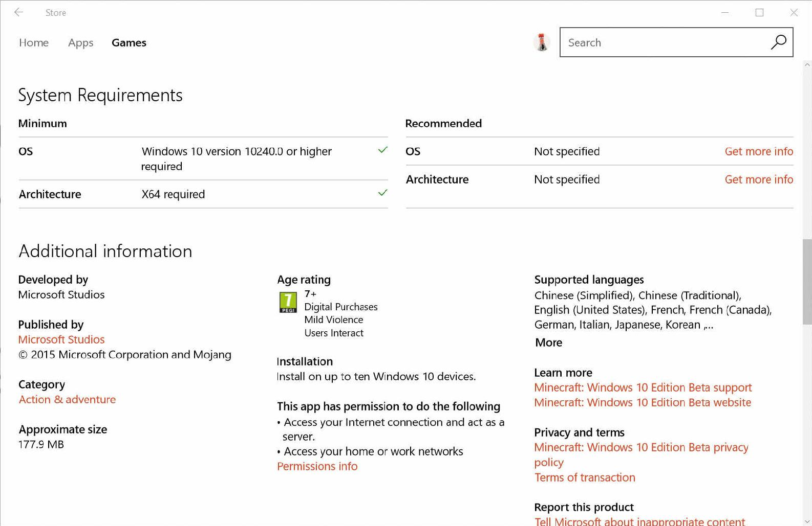
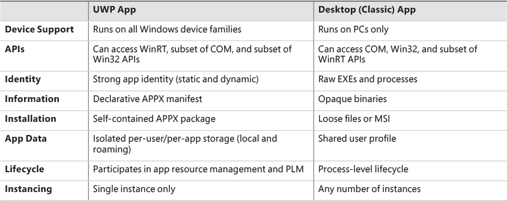
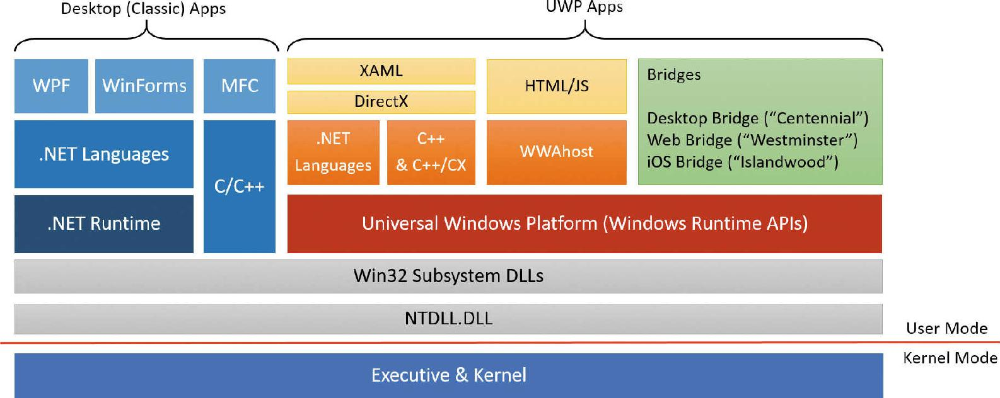
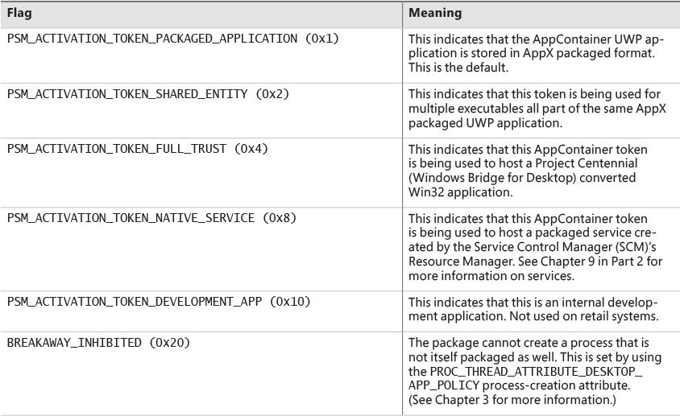
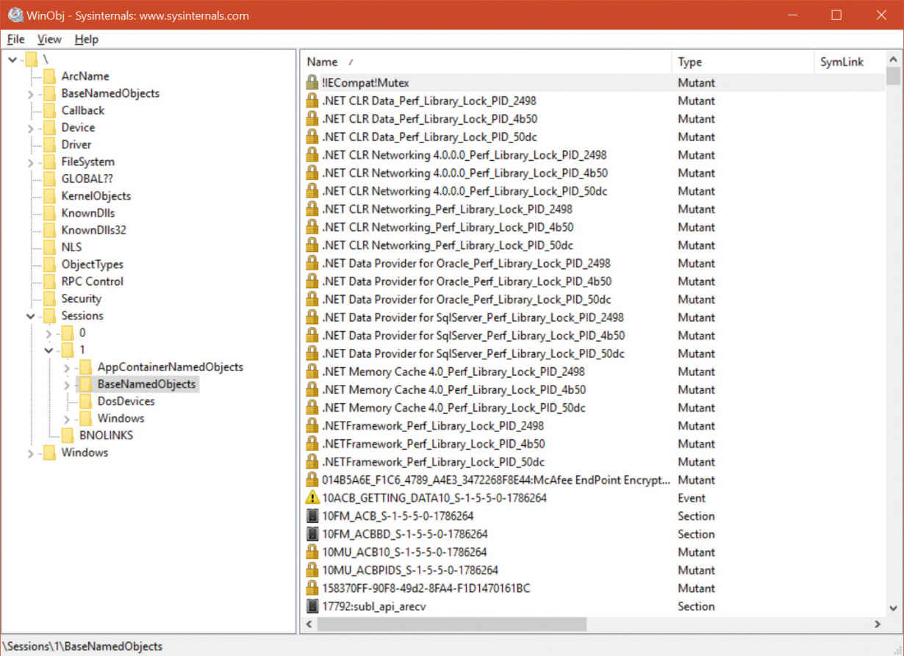
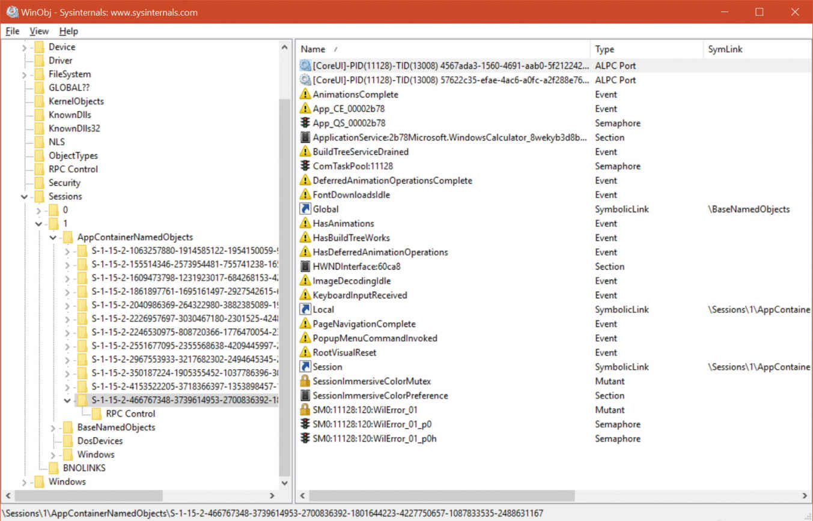

[TOC]


## 7.7 应用程序容器(AppContainers)

`Windows 8`引入了一个新的安全沙箱，称为`AppContainer`。虽然创建`AppContainers`主要是为了承载UWP进程，但实际上也可以用于“普通”进程(尽管没有内置工具来做这一点)。本节将主要介绍打包`AppContainers`的属性，它指的是与UWP进程关联的`Appcontainer`及其生成的`. appx`格式。对UWP应用程序的完整处理超出了本章的范围。你可以在本书的第三章和第二部分的第8章和第9章找到更多信息。在这里，我们将集中讨论`Appcontainer`的安全性，以及它们作为UWP应用程序主机的典型用法。

------

💬Note

`Universal Windows Platform`(UWP)应用程序是用来描述运行Windows运行时的进程的最新术语。更老的名字包括`immersive app`、`modern app`、`metro app`,，有时只是`Windows app`。通用部分表明，这些应用程序能够部署和运行在各种Windows 10版本和形式的因素，从物联网核心，移动，桌面，Xbox, HoloLens。然而，它们本质上与Windows 8中首次引入的功能相同。因此，本节讨论的`AppContainers`概念与Windows 8及其后续版本有关。请注意，通用应用平台(UAP)有时被用来代替`UWP`;这是一样的。

------

------

💬Note

`AppContainer`最初的代号是`LowBox`。在本节中，您可能会在许多API名称和数据结构中看到这个术语。它们指的是同一个概念。

------

### 7.7.1 UWP应用程序概述(Overview of UWP apps)

移动设备革命建立了获取和运行软件的新途径。移动设备通常从中央商店获取应用程序，自动安装和更新，几乎不需要用户干预。一旦用户从商店中选择了一个应用程序，她就可以看到该应用程序正常运行所需的权限。这些权限称为功能，并在包提交给存储时声明为包的一部分。这样，用户就可以决定这些功能是否可以接受。

图7-16显示了UWP游戏(Minecraft, Windows 10 beta版)的功能列表示例。游戏需要作为客户端和服务器访问互联网，并访问本地家庭或工作网络。一旦用户下载了游戏，他就默认游戏可以使用这些功能。相反地，用户可以确信游戏只使用这些功能。也就是说，游戏不可能使用其他未经批准的功能，如访问设备上的摄像头。



图7-16  Part of an app’s page in the store, showing capabilities, among other things.

要了解UWP应用程序和桌面(经典)应用程序之间的区别，请参考表7-12。从开发人员的角度看，Windows平台如图7-17所示。



表7-12 High-level comparison of UWP and desktop apps



图7-17 The Windows platform landscape.

- UWP应用程序可以生成普通的可执行文件，就像桌面应用程序一样。`Wwahost.exe (%SystemRoot%\ System32\ Wwahost.exe)`用于托管基于`HTML/ javascript`的UWP应用程序，因为这些程序生成一个DLL，而不是可执行文件。

- UWP是由Windows运行时api实现的，这些api是基于COM的一个增强版本。语言投影为c++(通过称为c++ /CX的专有语言扩展)、. net语言和JavaScript提供。这些投影使得从开发人员熟悉的环境中访问WinRT类型、方法、属性和事件变得相对容易。
- 有几种桥接技术可以将其他类型的应用程序转换为UWP。有关利用这些技术的更多信息，请参阅MSDN文档。
- Windows运行时是在Windows子系统dll之上分层的，就像。net框架一样。它没有内核组件，也不是不同子系统的一部分，因为它仍然利用系统提供的相同的Win32 api。然而，一些策略是在内核中实现的，以及对`appcontaine`r的一般支持。
- Windows运行时API是在%SystemRoot%\System32目录下的Dll中实现的，文件名的形式为Windows. xxx . yyy…Dll，其中的文件名通常表示实现的Windows运行时API命名空间。例如，Windows. globalization . dll实现了驻留在Windows中的类。全球化的名称空间。(完整的WinRT API参考，请参阅MSDN文档。)

### 7.7.2 应用程序容器(The AppContainer)

我们已经在第3章中看到了创建流程所需的步骤;我们还看到了创建UWP流程所需的一些额外步骤。创建的初始化是由`DCOMLaunch`服务执行的，因为UWP包支持一组协议，其中之一是Launch协议。结果进程在`AppContainer`中运行。以下是运行在`AppContainer`中的打包进程的几个特征:

- token完整性级别设置为Low，这将自动限制对许多对象的访问，并限制对流程某些api或功能的访问，本章前面已经讨论过。

- UWP进程总是在作业中创建(每个UWP应用程序一个作业)。该作业管理UWP进程和代表它执行的任何后台进程(通过嵌套作业)。这些作业允许进程状态管理器(PSM)在一次操作中暂停或恢复应用程序或后台处理。

- UWP进程的token有一个`AppContainer SID`，它表示基于UWP包名的SHA-2散列的独特标识。正如您将看到的，系统和其他应用程序使用这个SID显式地允许访问文件和其他内核对象。这个SID是`APPLICATION PACKAGE AUTHORITY`的一部分，而不是到目前为止您在本章中看到的大多数`NT AUTHORITY`。因此,它始于S-1-15-2字符串格式,对应`SECURITY_APP_PACKAGE_BASE_RID`(15)和`SECURITY_APP_PACKAGE_BASE_RID`(2)。因为SHA-2散列是32个字节,总共有八个RID(回想一下,去掉4字节的大小ULONG)在剩余的SID。

- token可能包含一组功能，每个功能都用SID表示。这些功能在应用程序清单中声明，并显示在商店中的应用程序页面上。存储在清单的功能部分中，它们使用稍后将看到的规则转换为SID格式，并且属于前面提到的相同的SID权限，但是使用众所周知的`SECURITY_CAPABILITY_BASE_RID`(3)。`Windows Runtime`中的各种组件、用户模式设备访问类和内核都可以寻找允许或拒绝某些操作的功能。

- token只能包含以下特权:`SeChangeNotifyPrivilege`, `SeIncrease-WorkingSetPrivilege`, `SeShutdownPrivilege`, `SeTimeZonePrivilege`和`SeUndockPrivilege`。这些是与标准用户帐户相关联的缺省权限集。此外，`ms-win-ntos-ksecurity API Set`契约扩展中的`AppContainerPrivilegesEnabledExt`函数部分可以出现在某些设备上，以进一步限制哪些特权是默认启用的。

- 该token最多包含四个安全属性(请参阅本章前面关于基于属性的访问控制的部分)，它们将标识该token与UWP打包的应用程序相关联。如前所述，这些属性是由负责激活UWP应用程序的`DcomLaunch`服务添加的。它们是:

  - `WIN://PKG`此标识该token属于UWP打包的应用程序。它包含一个带有应用程序原点和一些标志的整数值。取值请参见表7-13和表7-14。

    

    表7-13 Package origins

    

    表7-14 Package flags

  - `WIN://SYSAPPID`它包含应用程序标识符(称为包名或字符串名)，作为Unicode字符串值的数组。

  - `WIN://PKGHOSTID`标识UWP包主机ID，用于通过整数值显式标识主机的包。

  - `WIN://BGKD`仅用于后台主机(如通用后台任务主机`BackgroundTaskHost.exe`)，该主机可以存储打包的UWP服务，以COM provider的形式运行。该属性的名称代表background，并包含一个整数值，用于存储其显式的主机ID。

`TOKEN_LOWBOX` (0x4000)标志将在token的Flags成员中设置，该成员可以通过各种Windows和内核api(如`GetTokenInformation`)进行查询。这允许组件在`AppContainer`token存在的情况下以不同的方式进行标识和操作。

------

💬Note

第二种类型的`AppContainer`存在:子`AppContainer`。当UWP `AppContainer`(或父`AppContaine`r)希望创建自己的嵌套`AppContainer`以进一步锁定应用程序的安全性时，使用此方法。子`AppContainer`不是有8个rid，而是有4个额外的rid(前8个与父容器匹配)来唯一标识它。

------

首先是包主机ID，转换为十六进制:`0x6600000000001`。因为所有包主机id都以0x66开头，这意味着`Cortana`正在使用第一个可用的主机标识符:1。接下来是系统应用程序id，它包含三个字符串:强包名称、友好的应用程序名称和简化的包名称。最后，有包声明，十六进制为0x20001。根据表7-13和表7-14的字段，这表明收件箱(2)的来源，标志设置为`PSM_ACTIVATION_TOKEN_PACKAGED_APPLICATION`，确认`Cortana`是`AppX`包的一部分。

#### 7.7.2.1 AppContainer 安全环境

最大的副作用引起的存在一个`AppContainer SID`算法和相关的旗帜是访问检查你在“访问检查”一节中看到修改本章早些时候基本上忽略所有普通用户和组SIDstoken可能包含,本质上是把他们当做`deny-only SIDs`。这意味着，即使`Calculator`可能由属于Users和Everyone组的用户John Doe启动，它也将失败授予John Doe的SID、Users组SID或Everyone组SID访问权的任何访问检查。事实上，在自由访问检查算法期间检查的唯一SID将是`AppContainer SID`，然后是能力访问检查算法，它将检查token的任何能力SID部分。

除了仅仅将可自由支配的sid视为拒绝外，`AppContainer`token还对访问检查算法产生了进一步的关键安全更改:由于缺乏任何信息，NULL acl通常被视为允许任何人的情况(回想一下，这与空acl不同，空acl是由于显式允许规则而拒绝所有人的情况)，它被忽略并被视为拒绝的情况。简单地说，`AppContainer`可以访问的唯一安全对象类型是那些显式地为其`AppContainer SID`或其某个功能提供允许ACE的对象。甚至不安全的(NULL DACL)对象也退出了游戏。

这种情况会导致兼容性问题。如果连最基本的文件系统、注册表和对象管理器资源都不能访问，那么应用程序如何运行呢?Windows通过为每个`AppContainer`准备一个定制的执行环境(或者说是“监狱”)来考虑这一点。这些监狱如下:

------

💬Note

到目前为止，我们已经暗示每个UWP打包的应用程序对应于一个`AppContainer`token。然而，这并不一定意味着只有一个可执行文件可以与`AppContainer`关联。UWP包可以包含多个可执行文件，它们都属于同一个`AppContainer`。这允许它们共享相同的SID和功能，并在彼此之间交换数据，例如微服务后端可执行文件和前台前端可执行文件。

------

- `AppContainer SID`的字符串表示用于在对象管理器的命名空间中创建一个子目录，位于`\Sessions\x\AppContainerNamedObjects`之下。这将成为命名内核对象的私有目录。然后使用与具有允许所有访问掩码的`AppContainer`关联的`AppContainer SID`对这个特定的子目录对象进行ACLed。这与桌面应用程序形成对比，桌面应用程序都使用`Sessions\x\BaseNamedObjects`子目录(在同一个session x中)。我们将很快讨论它的含义，以及token现在存储句柄的要求。
- token将包含一个`LowBox`编号，它是内核存储在`g_SessionLowboxArray`全局变量中的`LowBox`编号Entry结构数组的唯一标识符。其中的每一个都映射到`SEP_LOWBOX_NUMBER_ENTRY`结构，最重要的是，该结构包含这个`AppContainer`唯一的原子表，因为`Windows`子系统内核模式驱动程序(Win32k.sys)不允许`AppContainer`访问全局原子表。
- 文件系统在`%LOCALAPPDATA%`中包含一个名为`Packages`的目录。它里面是所有安装的UWP应用程序的包名(`AppContainer sid`的字符串版本，即包名)。每个应用程序目录都包含特定于应用程序的目录，如TempState、RoamingState、Settings、LocalCache等，这些目录都使用与应用程序相对应的特定`AppContainer SID`进行ACLed，并设置为一个`allow-all`访问掩码。
- Settings目录中有一个`Settings.dat`文件，这是一个作为应用程序hive加载的注册表hive文件。(您将在第2部分的第9章中了解关于应用程序hive的更多信息。)hive充当应用程序的本地注册表，在这里WinRT api存储应用程序的各种持久状态。同样，注册表项上的ACL显式地授予对关联`AppContainer SID`的`allow-all`访问权。

这四个“监狱”允许`AppContainers`安全地本地存储它们的文件系统、注册表和原子表，而不需要访问系统上的敏感用户和系统区域。也就是说，至少在只读模式下，访问关键系统文件(如Ntdll.dll和Kernel32.dll)或注册表键(如这些库将需要的键)，甚至命名对象(如用于DNS查找的`\RPC Control\DNSResolver ALPC`端口)的能力如何?对于每个UWP应用程序或卸载，`re-ACL`整个目录、注册表项和对象名称空间以添加或删除各种sid是没有意义的。

为了解决这个问题，安全子系统理解一个名为`ALL APPLICATION PACKAGES`的特定组SID，它会自动将自己绑定到任何`AppContainer`token。许多关键的系统位置，如`%SystemRoot%` `System32`和`HKLM\Software\Microsoft\Windows\CurrentVersion`，将这个SID作为其DACL的一部分，通常带有读或读-执行访问掩码。对象管理器名称空间中的某些对象也将具有此特性，例如\RPC Control对象管理器目录中的DNSResolver ALPC端口。其他例子包括某些授予执行权的COM对象。尽管没有正式的文档，但第三方开发人员在创建非UWP应用程序时，也可以通过将此SID应用到自己的资源来允许与UWP应用程序进行交互。

不幸的是,由于UWP技术应用程序可以加载任何Win32 DLL作为WinRT的一部分需求(WinRT是建立在Win32之上,因为当你看到),因为很难预测个体UWP应用程序可能需要什么,很多系统资源与他们相关联的所有应用程序包SID DACL作为预防措施。这意味着UWP开发人员没有办法阻止从他们的应用程序中进行DNS查找。这种超出需求的访问对漏洞编写人员也很有帮助，他们可以利用它来逃离AppContainer沙箱。Windows 10的新版本，从1607版本(周年更新)开始，包含了一个额外的安全元素来对抗这种风险:受限的应用容器。

通过使用`PROC_THREAD_ATTRIBUTE_ALL_APPLICATION_PACKAGES_POLICY`过程属性和设置它在进程创建`PROCESS_CREATION_ALL_APPLICATION_PACKAGES_OPT_OUT`(有关更多信息,请参见第3章过程属性),token将不会与任何指定的ace SID所有应用程序包,切断对许多系统资源的访问，否则这些资源是可以访问的。可以通过出现第四个标记属性`WIN://NOALLAPPPKG`来标识这些标记，该标记的整数值设置为1。

当然，这又把我们带回了同一个问题:这样的应用程序如何能够加载Ntdll.dll，这是任何进程初始化的关键?Windows 10版本1607引入了一个名为`ALL RESTRICTED ``APPLICATION PACKAGES`的新组，它解决了这个问题。例如，System32目录现在也包含这个SID，也设置为允许读取和执行权限，因为在这个目录中加载dll即使对大多数沙箱进程也是关键。然而，`DNSResolver`的ALPC端口没有，所以这样的`AppContainer`将失去对DNS的访问。

#### 7.7.2.2 AppContainer功能(AppContainer capabilities)

正如您刚才看到的，UWP应用程序的访问权限非常有限。那么，例如，Microsoft Edge应用程序如何能够解析本地文件系统并打开用户的Documents文件夹中的PDF文件?类似地，Music应用程序如何从Music目录播放MP3文件?无论直接通过内核访问检查还是通过代理(您将在下一节中看到)，关键都在于功能sid。让我们看看它们来自何处、如何创建以及何时使用。

首先，UWP开发人员首先创建一个应用程序清单，其中指定了应用程序的许多细节，比如包名、徽标、资源、支持的设备等等。功能管理的关键元素之一是清单中的功能列表。例如，让我们看一下Cortana的应用程序清单，位于`%SystemRoot%\SystemApps\Microsoft.Windows.Cortana_cw5n1h2txywey\AppxManifest.xml`:

```xml
 <Capabilities>
            <wincap:Capability Name="packageContents"/>
            <!-- Needed for resolving MRT strings -->
            <wincap:Capability Name="cortanaSettings"/>
            <wincap:Capability Name="cloudStore"/>
            <wincap:Capability Name="visualElementsSystem"/>
            <wincap:Capability Name="perceptionSystem"/>
            <Capability Name="internetClient"/>
            <Capability Name="internetClientServer"/>
            <Capability Name="privateNetworkClientServer"/>
            <uap:Capability Name="enterpriseAuthentication"/>
            <uap:Capability Name="musicLibrary"/>
            <uap:Capability Name="phoneCall"/>
            <uap:Capability Name="picturesLibrary"/>
            <uap:Capability Name="sharedUserCertificates"/>
            <rescap:Capability Name="locationHistory"/>
            <rescap:Capability Name="userDataSystem"/>
            <rescap:Capability Name="contactsSystem"/>
            <rescap:Capability Name="phoneCallHistorySystem"/>
            <rescap:Capability Name="appointmentsSystem"/>
            <rescap:Capability Name="chatSystem"/>
            <rescap:Capability Name="smsSend"/>
            <rescap:Capability Name="emailSystem"/>
            <rescap:Capability Name="packageQuery"/>
            <rescap:Capability Name="slapiQueryLicenseValue"/>
            <rescap:Capability Name="secondaryAuthenticationFactor"/>
            <DeviceCapability Name="microphone"/>
            <DeviceCapability Name="location"/>
             <DeviceCapability Name="wiFiControl"/>
   </Capabilities>
```

您将在这个列表中看到许多类型的条目。例如，Capability条目包含与在Windows 8中实现的原始能力集相关联的已知sid。它们以security_capability_开始—例如，`SECURITY_CAPABILITY_INTERNET_CLIENT`，它是`APPLICATION PACKAGE AUTHORITY`下的能力RID的一部分。这给了我们一个字符串格式的SID s - 1-15-1。

其他条目以uap、rescap和wincap为前缀。其中一个(rescap)指的是受限的能力。这些功能需要来自微软的特殊支持和自定义批准，才能在商店中使用。在Cortana的例子中，这些功能包括访问SMS文本消息、电子邮件、联系人、位置和用户数据等。另一方面，Windows功能指的是为Windows和系统应用程序保留的功能。没有商店应用程序可以使用这些。最后，UAP功能是指任何人都可以在商店请求的标准功能。(请记住，UAP是UWP的旧名称。)

与映射到硬编码rid的第一组功能不同，这些功能以不同的方式实现。这确保了不需要经常维护已知rid的列表。相反，使用这种模式，功能可以完全定制并动态更新。为此，他们只需要获取功能字符串，将其转换为全大写格式，并获取结果字符串的SHA-2散列，就像`AppContainer`包sid是包名称的SHA-2散列一样。同样，由于SHA-2散列是32字节，因此每个功能都有8个rid，紧跟众所周知的`SECURITY_CAPABILITY_BASE_RID`(3)。

最后，您会注意到一些`DeviceCapability`条目。这些引用UWP应用程序需要访问的设备类，可以通过上面看到的众所周知的字符串来标识，也可以直接通过标识设备类的GUID来标识。本文没有使用前面介绍的两种SID创建方法中的一种，而是使用了第三种方法!对于这些类型的功能，GUID被转换成二进制格式，然后映射到四个rid(因为GUID是16字节)。另一方面，如果指定了众所周知的名称，则必须首先将其转换为GUID。这是通过查看`HKLM\Software\Microsoft\Windows\CurrentVersion\DeviceAccess\ abilityymuments`注册键来实现的，该注册键包含与设备功能相关联的注册键列表和映射到这些功能的guid列表。guid随后被转换为SID，正如您刚才看到的。

作为将所有这些功能编码到token中的一部分，需要应用两个额外的规则:

- 正如您在前面的实验中所看到的，每个`AppContainer`token都包含其自己的包SID，并将其编码为一个功能。这可以被能力系统用于通过公共安全检查来专门锁定对特定应用程序的访问，而不是分别获取和验证包SID。
- 通过使用`SECURITY_CAPABILITY_APP_RID (1024) RID`作为常规8功能散列RID之前的额外子权限，每个功能被重新编码为组SID。

在将功能编码到token中之后，系统的各个组件将读取它们，以确定`AppContainer`正在执行的操作是否应该被允许。您会注意到，大多数api都没有文档记录，因为官方不支持与UWP应用程序的通信和互操作性，最好留给代理服务、收件箱驱动程序或内核组件。例如，内核和驱动程序可以使用`RtlCapabilityCheck API`来验证对某些硬件接口或API的访问。

例如，电源管理器在允许从`AppContainer`请求关闭屏幕之前检查ID_CAP_SCREENOFF功能。蓝牙端口驱动检查`bluetoothDiagnostics`能力，而应用程序身份驱动检查企业数据保护(EDP)支持通过`enterprisedatpolicy`能力。在用户模式下，可以使用文档化的`CheckTokenCapability API`，尽管它必须知道功能的SID而不是提供名称(然而，文档化的`RtlDeriveCapabilitySidFromName`可以生成它)。另一个选项是没有文档的`CapabilityCheck API`，它接受一个字符串。

最后，许多RPC服务利用了`RpcClientCapabilityCheck API`，这是一个帮助函数，负责检索token，只需要能力字符串。这个函数被许多采用winrt的服务和代理非常常用，它们利用RPC与UWP客户机应用程序通信。

一些UWP应用程序被称为可信的，尽管它们像其他UWP应用程序一样使用Windows运行时平台，但它们并不在`AppContainer`中运行，并且具有比Low更高的完整性级别。典型的例子是系统设置应用程序(`%SystemRoot%\ImmersiveControlPanel\SystemSettings.exe`);这似乎是合理的，因为设置应用必须能够对系统做出改变，而这在`appcontainer`托管的进程中是不可能做到的。如果您查看它的token，您将看到相同的三个属性—`pkg、SYSAPPID和pkghostid`—这些属性确认它仍然是一个打包的应用程序，即使没有`AppContainer`token。

#### 7.7.2.3 应用程序容器和对象名称空间(AppContainer and object namespace)

桌面应用程序可以很容易地按名称共享内核对象。例如，假设进程A通过调用名为`MyEvent`的`CreateEvent(Ex)`来创建一个事件对象。它返回一个句柄，以后可以使用它来操纵事件。在同一个会话中运行的进程B可以调用相同名称的`CreateEvent(Ex)`或`OpenEvent (MyEvent)`，并且(假设它有适当的权限，这通常是在同一个会话下运行的情况)获得相同的底层事件对象的另一个句柄。现在，如果进程A在事件对象上调用SetEvent，而进程B在调用其事件句柄上的`WaitForSingleObject`时被阻塞，进程B的等待线程将被释放，因为它是同一个事件对象。这种共享之所以有效，是因为命名对象是在对象管理器目录`\Sessions\x\BaseNamedObjects`中创建的，如图7-18所示，使用`WinObj Sysinternals`工具。



图7-18 Object manager directory for named objects.

此外，桌面应用程序可以通过使用前缀为Global\的名称在会话之间共享对象。这将在session 0对象目录中创建一个位于`\BaseNamedObjects`(参考图7-18)的对象。

基于appcontainer的进程的根对象名称空间位于`\Sessions\x\AppContainerNamedObjects\`。因为每个`AppContainer`都有一个不同的AppContainer SID，所以两个UWP应用程序不可能共享内核对象。AppContainer进程不允许在会话0对象命名空间中创建命名内核对象。图7-19显示了Windows UWP计算器应用程序的对象管理器目录。



图7-19  Object manager directory for Calculator.

想要共享数据的UWP应用程序可以使用定义良好的合约，由Windows运行时管理。(更多信息请参阅MSDN文档。)

在桌面应用程序和UWP应用程序之间共享内核对象是可能的，并且通常由代理服务来完成。例如，当从文件选择器代理请求访问Documents文件夹中的文件(并验证正确的功能)时，UWP应用程序将接收一个文件句柄，它可以直接使用该句柄进行读写，而无需来回编组请求。这是通过让代理复制它直接在UWP应用程序的句柄表中获得的文件句柄来实现的。(关于句柄重复的更多信息见第2部分的第8章。)为了进一步简化，ALPC子系统(也在第8章中描述)允许以这种方式通过ALPC句柄属性自动转移句柄。使用ALPC作为底层协议的远程过程调用(`Remote Procedure Call`, RPC)服务可以将此功能作为其接口的一部分。IDL文件中的可编组句柄将以这种方式通过ALPC子系统自动传输。

在官方代理RPC服务之外，桌面应用程序通常可以创建一个已命名(甚至未命名)对象，然后使用`DuplicateHandle`函数将相同对象的句柄手动注入UWP进程。这是因为桌面应用程序通常以中等完整性级别运行，没有什么可以阻止它们将句柄复制到UWP进程中——只有相反的方法。

#### 7.7.2.4 应用程序容器句柄(AppContainer handles)

在典型的Win32应用程序中，会话本地和全局`BaseNamedObjects`目录的存在是由Windows子系统保证的，因为它在引导和会话创建时创建这个目录。不幸的是，`AppContainerBaseNamedObjects`目录实际上是由启动应用程序本身创建的。在UWP激活的情况下，这是受信任的`DComLaunch`服务，但请记住，并非所有的appcontainer都必须绑定到UWP。还可以通过正确的流程创建属性手动创建它们。(请参阅第3章，了解使用哪种方法的更多信息。)在这种情况下，不受信任的应用程序可能已经创建了对象目录(并且需要其中的符号链接)，这将导致该应用程序能够从AppContainer应用程序下面关闭句柄。即使没有恶意意图，初始启动的应用程序也可能退出，清理其句柄并销毁特定于appcontainer的对象目录。为了避免这种情况，AppContainertoken具有存储句柄数组的能力，这些句柄数组保证在使用该token的任何应用程序的生命周期中都存在。这些句柄最初是在创建AppContainer token时传入的(通过`NtCreateLowBoxToken`)，并复制为内核句柄。

类似于`per-AppContainer`原子表，使用了一个特殊的`SEP_CACHED_HANDLES_ENTRY`结构，这一次基于存储在该用户登录会话结构中的哈希表。(有关登录会话的更多信息，请参阅本章后面的“登录”一节。)该结构包含在AppContainer令牌创建期间复制的内核句柄数组。当这个令牌被销毁(因为应用程序正在退出)或用户注销(这将导致注销登录会话)时，它们将被关闭。

最后,由于能力已命名对象限制在一个特定的对象目录名称空间是一个宝贵的沙盒安全工具命名对象访问,即将到来的(在撰写本文时)Windows 10创造者更新包含一个额外的能力称为令牌BNO隔离(BNO指`BaseNamedObjects`)。使用相同的`SEP_CACHE_HANDLES_ENTRY`结构，一个新的字段`BnoIsolationHandlesEntry`被添加到TOKEN结构中，类型设置为`SepCachedHandlesEntryBnoIsolation`而不是`SepCachedHandlesEntryLowbox`。要使用此特性，必须使用一个特殊的process属性(有关更多信息，请参阅第3章)，该属性包含一个隔离前缀和一个句柄列表。此时，使用了相同的LowBox机制，但不是使用`AppContainer SID`对象目录，而是使用属性中指示的带有前缀的目录。

因为`AppContainer`进程几乎没有权限，除了那些隐式授予的功能，一些常见的操作不能直接由AppContainer执行，需要帮助。(没有针对这些的功能，因为这些级别太低，用户无法在商店中看到，而且很难管理。)一些例子包括使用公共文件打开对话框选择文件或使用打印对话框打印。对于这些和其他类似的操作，Windows提供了被称为代理的帮助进程，由系统代理进程`RuntimeBroker.exe`管理。

需要这些服务的AppContainer进程通过一个安全的ALPC通道与`Runtime Broker`通信，`Runtime Broker`会启动所请求的代理进程的创建。

例如`%SystemRoot% PrintDialog\PrintDialog.exe`和`%SystemRoot% System32\PickerHost.exe`。

