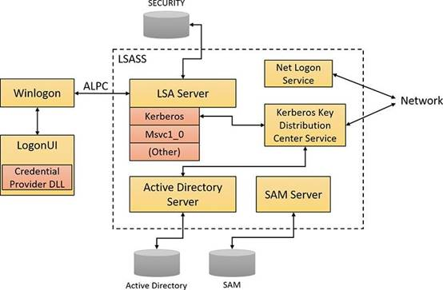
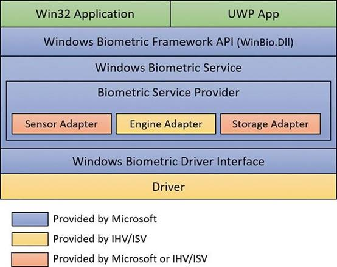

## 7.8 登录(logon) 

交互式登录（相对于网络登录而言）是通过以下的互动发生的。

- 登录程序（Winlogon.exe）。 

- 登录用户界面进程（LogonUI.exe）及其凭证提供者 

- Lsass.exe 

- 一个或多个认证包 

- SAM 或活动目录 

认证包是执行认证检查的 DLLsKerberos 是用于交互式登录到域的
 Windows 认证包。MSV1_0 是用于交互式登录本地计算机的 Windows 认证包，用于登录到受信任的 Windows 2000 之前的域，以及在无法访问域控制器的情况下。 

Winlogon 是一个可信的进程，负责管理与安全有关的用户互动。它协调登

录，在登录时启动用户的第一个进程，并处理注销。它还管理与安全有关的各种其他操作，包括启动 LogonUI 以在登录时输入密码、更改密码以及锁定和解锁工作站。Winlogon 进程必须确保与安全有关的操作不被任何其他活动进程看到。例如，Winlogon 保证一个不受信任的进程不能在这些操作中获得桌面的控制权，从而获得对密码的访问。 

Winlogon 依靠安装在系统上的凭证提供者来获取用户的账户名或密码。凭

证提供者是位于 DLLs 内的 COM 对象。默认的提供者是 authui.dll、

SmartcardCredentialProvider.dll 和 FaceCredentialProvider.dll，它们分别支持密码、智能卡密码和面部识别认证。允许安装其他凭证提供者使 Windows 能够使用不同的用户识别机制。例如，第三方可能会提供一个凭证提供者，使用拇指指纹识别设备来识别用户并从加密的数据库中提取他们的密码。凭证提供者被列在

HKLM\SOFTWARE\MicrosoftWindows\CurrentVersion\Authentication\C redential Providers 中，其中每个子键通过其 COM CLSID 来识别一个凭证提供者类别。(CLSID 本身必须像其他 COM 类一样在 HKCR\CLSID 注册。)你可以使用本书可下载资源中提供的 CPlist.exe 工具来列出带有其 CLSID、友好名称和实现 DLL 的凭证提供者。 

为了保护 Winlogon 的地址空间不受凭证提供程序中的错误影响，这些错误可能会导致 Winlogon 进程崩溃（这反过来又会导致系统崩溃，因为 Winlogon 被认为是一个关键的系统进程），一个单独的进程 LogonUI.exe 被用来实际加载凭证提供程序并向用户显示 Windows 登录界面。每当 Winlogon 需要向用户展示用户界面时，这个进程就会按需启动，并在行动结束后退出。它还允许

Winlogon 简单地重新启动一个新的 LogonUI 进程，如果它因任何原因崩溃。

Winlogon 是唯一一个拦截来自键盘的登录请求的进程。这些请求是通过

Win32k.sys 的 RPC 消息发送的。Winlogon 立即启动 LogonUI 应用程序以显示登录的用户界面。在从凭证提供者那里获得用户名和密码后，Winlogon 调用

Lsass 来验证试图登录的用户。如果用户被认证，登录过程将代表该用户激活一个登录外壳。图 7-20 说明了参与登录的组件之间的互动。

 

**图 7-20** 登录时涉及的组件。

除了支持替代的凭证提供者，LogonUI 可以加载需要执行二级认证的额外网络提供者 DLL。这种能力允许多个网络提供者在正常登录期间一次性收集识别和认证信息。一个登录到 Windows 系统的用户可能同时在一个 Linux 服务器上被认证。然后，该用户将能够从 Windows 机器上访问 UNIX 服务器的资源，而不需要额外的认证。这种能力被称为单点登录的一种形式。

### 7.8.1 Winlogon 初始化 

在系统初始化期间，在任何用户应用程序被激活之前，Winlogon 会执行以下步骤，以确保在系统准备好与用户互动时控制工作站。 

**1.**它创建并打开一个交互式窗口站（例如，对象管理器命名空间中的

\Sessions\1\Windows\WindowStations\WinSta0）来代表键盘、鼠标和显示器。Winlogon 为工作站创建一个安全描述符，该描述符有一个且只有一个 ACE，只包含系统 SID。这个唯一的安全描述符确保没有其他进程可以访问该工作站，除非 Winlogon 明确允许。 

**2.**它创建并打开两个桌面：一个应用程序桌面

（\Sessions\1\Windows\WinSta0\Default，也称为互动桌面）和一个

Winlogon 桌面（\Sessions\1\Windows\WinSta0\Winlogon，也称为安全桌面）。Winlogon 桌面上的安全性被创建，以便只有 Winlogon 可以访问该桌面。另一个桌面允许 Winlogon 和用户访问它。这种安排意味着，任何时候 Winlogon 桌面处于活动状态，其他进程都不能访问与该桌面相关的任何活动代码或数据。Windows 使用这一功能来保护涉及密码以及锁定和解锁桌面的安全操作。 

**3.**在任何人登录计算机之前，可见的桌面是 Winlogon 的。在用户登录后，按 SAS 序列（默认为 Ctrl+Alt+Del）将桌面从 Default 切换到 Winlogon 并启动 LogonUI。(这就解释了为什么当你按下 Ctrl+Alt+Del 时，你的交互式桌面上的所有窗口似乎都消失了，而当你解除 Windows 安全对话框时又恢复了）。)因此，SAS 总是带出一个由 Winlogon 控制的安全桌面。 

**4.**它与 Lsass 建立了一个 ALPC 连接。这个连接将用于在登录、注销和密码操作期间交换信息，并通过调用 LsaRegisterLogonProcess 来建立。 

**5.**它注册了 Winlogon RPC 消息服务器，它监听来自 Win32k 的 SAS、注销和工作站锁定通知。这项措施可以防止特洛伊木马程序在进入 SAS 时获得对屏幕的控制。 

------

 

💬 Note

Wininit 进程执行与步骤 1 和 2 类似的步骤，以允许在会话 0 上运行的传统交互式服务显示窗口，但它不执行任何其他步骤，因为会话 0 不能用于用户登录。  

------

### 7.8.2  用户登录步骤

当用户按下 SAS（Ctrl+Alt+Del）时，登录开始。在按下 SAS 后，Winlogon 启动 LogonUI，它调用凭证提供者以获得一个用户名和密码。Winlogon 还为

这个用户创建了一个独特的本地登录 SID，并将其分配给桌面的这个实例（键盘、屏幕和鼠标）。Winlogon 将这个 SID 作为 LsaLogonUser 调用的一部分传递给 Lsass。如果用户成功登录，这个 SID 将包括在登录过程中的令牌--一个保护对桌面访问的步骤。例如，另一个登录到同一账户但在不同系统上的人将无法写

入第一台机器的桌面，因为这第二个登录者不会在第一个登录者的桌面令牌中。

当用户名和密码被输入后，Winlogon 通过调用 Lsass 函数

LsaLookupAuthenticationPackage 来检索一个包的句柄。认证包被列在注册表的 HKLM\SYSTEM\CurrentControlSet\Control\Lsa 下。Winlogon 通过LsaLogonUser将登录信息传递给认证包。一旦一个软件包验证了一个用户，

Winlogon 就会继续该用户的登录过程。如果没有一个认证包显示登录成功，则登录过程被中止。

Windows 使用两个标准认证包，用于基于用户名/密码的交互式登录。 

- **MSV1_0** 单机Windows系统上的默认认证包是MSV1_0（Msv1_0.dll)，这是一个实现 LAN Manager 2 协议的认证包。Lsass 还在域成员计算机上使用 MSV1_0，以验证 Windows 2000 之前的域和无法定位域控制器的计算机的认证。(与网络断开连接的计算机属于这后一类）。) 

- **Kerberos** Kerberos 认证包，Kerberos.dll，在属于 Windows 域的计算机上使用。在域控制器上运行的 Kerberos 服务的配合下，Windows Kerberos 软件包支持 Kerberos 协议。这个协议是基于 Internet RFC 1510 的。(请访问互联网工程任务组[IETF]网站[http://www.ietf.org](http://www.ietf.org/)[，](http://www.ietf.org/)了解有关 Kerberos 标准的详细情况)。 

#### 7.8.2.1 MSV1_0

MSV1_0 认证包接受用户名和密码的散列版本，并向本地 SAM 发送请求以检索账户信息，其中包括散列密码、用户所属的组以及任何账户限制。MSV1_0 首先检查账户限制，如允许访问的时间或类型。如果用户因为 SAM 数据库中的限制而不能登录，则登录调用失败，MSV1_0 向 LSA 返回一个失败状态。 

然后，MSV1_0 将散列的密码和用户名与从 SAM 获得的密码和用户名进行

比较。在缓存域名登录的情况下，MSV1_0 通过使用 Lsass 函数来访问缓存信息，该函数从 LSA 数据库（注册表的 SECURITY 蜂巢）存储和检索 "秘密"。如果信息匹配，MSV1_0 为登录会话生成一个 LUID，并通过调用 Lsass 创建登录会话，将这个唯一的标识符与会话相关联，并传递所需信息，最终为用户创建一个访问

令牌。(回顾一下，访问令牌包括用户的 SID、组 SID 和分配的权限）。) 

------

💬Note 

MSV1_0 没有在注册表中缓存用户的整个密码哈希值，因为这将使有物理访问权的人能够轻易破坏用户的域账户，并获得对加密文件和用户被授权访问的网络资源的访问权。相反，它缓存了一半的哈希值。缓存的一半哈希值足以验证用户的密码是否正确，但它不足以获得对 EFS 密钥的访问，也不足以在域上以用户身份进行认证，因为这些操作需要完整的哈希值。  

------

如果 MSV1_0 需要使用一个远程系统进行验证，比如当用户登录到一个受信任的 Windows 2000 之前的域时，MSV1_0 使用 Netlogon 服务与远程系统上的 Netlogon 实例进行通信。远程系统上的 Netlogon 与该系统上的 MSV1_0 认证包进行交互，将认证结果传回给正在执行登录的系统。

#### 7.8.2.2 Kerberos 

Kerberos 认证的基本控制流程与 MSV1_0 的流程相同。然而，在大多数情况下，域登录是从成员工作站或服务器上执行的，而不是在域控制器上，所以认证包必须作为认证过程的一部分在网络上通信。该软件包通过 Kerberos TCP/IP 端口（端口 88）与域控制器上的 Kerberos 服务进行通信。实现 Kerberos 认证协议的 Kerberos 密钥分发中心服务（Kdcsvc.dll）在域控制器的 Lsass 进程中运行。 

在用活动目录的用户账户对象（使用活动目录服务器 Ntdsa.dll）验证散列的用户名和密码信息后，Kdcsvc 将域凭证返回给 Lsass，Lsass 将验证结果和用户

的域登录凭证（如果登录成功）通过网络返回给正在进行登录的系统。

------

💬Note

这段关于 Kerberos 认证的描述是高度简化的，但它强调了所涉及的各种组件的作用。尽管 Kerberos 认证协议在 Windows 的分布式域安全中起着关键作用，但其细节不在本书的讨论范围之内。

------

 在登录被验证后，Lsass 在本地策略数据库中寻找用户的允许访问，包括互动、网络、批处理或服务进程。如果请求的登录与允许的访问不匹配，登录尝试将被终止。Lsass 通过清理其任何数据结构来删除新创建的登录会话，然后将失败返回给 Winlogon，后者又向用户显示一个适当的消息。如果请求的访问被允许，Lsass 添加适当的额外安全 ID（如 Everyone、Interactive 等）。然后，它检查其策略数据库，查看该用户的所有 SID 的任何授权权限，并将这些权限添加到用户的访问令牌中。 

当 Lsass 积累了所有必要的信息，它调用执行器来创建访问令牌。执行器为交互式或服务登录创建一个主访问令牌，为网络登录创建一个冒充令牌。访问令牌成功创建后，Lsass 复制令牌，创建一个可以传递给 Winlogon 的句柄，并关闭自己的句柄。如果有必要，登录操作会被审计。在这一点上，Lsass 将成功与访问令牌的句柄、登录会话的 LUID 以及认证包返回的配置文件信息（如有）一起返回给 Winlogon。 

然后Windows在注册表中查看HKLM\SOFTWARE\Microsoft\Windows NT\Current Version\Winlogon\Userinit并创建一个进程来运行该字符串的任何值。(默认值是 Userinit.exe，它加载用户配置文件，然后创建一个进程来运行任何HKCU\SOFTWARE\Microsoft\Windows NT\Current Version\Winlogon\Shell 的值，如果该值存在的话。然而，这个值在默认情况下并不存在。如果它不存在，Userinit.exe 会对HKLM\SOFTWARE\Microsoft/Windows NT\Current Version\Winlogon\Shell 进行同样的处理，它默认为 Explorer.exe。Userinit

随后退出（这就是为什么 Explorer.exe 在进程资源管理器中显示为没有父级）。关于用户登录过程中的步骤的更多信息，请参见第二部分的第 11 章。

### 7.8.3 有保证的认证

基于密码的认证的一个基本问题是，密码可能被泄露或窃取，并被恶意的第三方使用。Windows 包括一个跟踪用户如何与系统认证的认证强度的机制，这允许在用户没有安全认证的情况下保护对象不被访问。(智能卡认证被认为是一种比密码认证更强的认证形式）。) 

在加入域的系统中，域管理员可以指定用于验证用户的证书（如智能卡或硬

件安全令牌上的）上的对象标识符（OID）（代表特定对象类型的唯一数字字符串）与用户成功验证系统时被放入用户访问令牌的 SID 之间的映射。一个对象上的 DACL 中的 ACE 可以指定这样一个 SID 是用户令牌的一部分，以便用户获得对该对象的访问。从技术上讲，这被称为一个组的要求。换句话说，用户声称自己是某一特定组的成员，该组被允许在特定对象上有某些访问权，该声明是基于认证机制的。这个功能在默认情况下是不启用的，它必须由基于证书的认证的域的域管理员配置。保证认证以现有的 Windows 安全功能为基础，为 IT 管理员和任何关心企业IT 安全的人提供了很大的灵活性。企业决定在用于验证用户的证书中嵌入哪些OIDs，以及特定 OIDs 与活动目录通用组（SIDs）的映射。一个用户的组成员资格可以用来识别在登录操作中是否使用了证书。不同的证书可以有不同的发行策略，因此也有不同的安全级别，可以用来保护高度敏感的对象（如文件或其他可能有安全描述符的东西）。认证协议（AP）在基于证书的认证过程中从证书中检索 OIDs。这些 OID 必须被映射到 SID，而 SID 又在组成员扩展过程中被处理，并被置于访问令牌中。OID 到通用组的映射在活动目录中被指定。 

例如，一个组织可能有几个名为 "承包商"、"全职雇员 "和 "高级管理人员 " 的证书颁发策略，它们分别映射到 "承包商-用户"、"全职雇员-用户 "和 "SM用户 "等通用组。一个名为 Abby 的用户拥有一张智能卡，其证书是用高级管理层的签发策略签发的。当她使用她的智能卡登录时，她会收到一个额外的组成员资格（由她访问令牌中的 SID 表示），表明她是 SM-用户组的成员。可以在对象上设置权限（使用 ACL），这样只有 FTE-Users 或 SM-Users 组的成员（由ACE 中的 SID 识别）被授予访问权。如果 Abby 用她的智能卡登录，她可以访问这些对象，但如果她只用她的用户名和密码登录（没有智能卡），她不能访问这些对象，因为她的访问令牌中没有 FTE-Users 或 SM-Users 组。一个叫 Toby 的用户用智能卡登录，该卡有一个使用承包商签发策略签发的证书，他将不能访问一个有 ACE 要求 FTE-Users 或 SM-Users 组成员资格的对象。 

**Windows** **生物识别框架** 

Windows 提供了一个标准化的机制来支持某些类型的生物识别设备，如指纹扫描仪，用于通过刷指纹来进行用户识别：Windows 生物识别框架（WBF）。像其他许多这样的框架一样，WBF 的开发是为了隔离支持此类设备所涉及的各种功能，以便将实现新设备所需的代码降到最低。 

WBF 的主要组件如图 7-21 所示。除了在下面的列表中指出，所有这些组件都由 Windows 提供。 

- **Windows** **生物识别服务（%SystemRoot%\System32\Wbiosrvc.dll** 这提供了一个或多个生物识别服务提供商可以执行的进程执行环境。 

- **Windows** **生物识别驱动程序接口（WBDI）**这是一套接口定义（IRP 主要功能代码、DeviceIoControlcodes 等），任何生物识别扫描仪设备的驱动程序必须符合这些定义，才能与 Windows 生物识别服务兼容。WBDI 驱动可以使用任何一个标准驱动框架（UMDF、KMDF 和 WDM)来开发。然而，推荐使用UMDF以减少代码大小并提高可靠性。WBDI在Windows驱动套件文档中有所描述。 

- **Windows 生物识别 API** 这允许现有的 Windows 组件，如 Winlogon和 LogonUI，访问生物识别服务。第三方应用程序可以访问 Windows生物识别 API，并可以将生物识别扫描仪用于登录 Windows 以外的功能。这个 API 中的一个函数的例子是 WinBioEnumServiceProviders。生物识别 API 是由%SystemRoot%\System32\Winbio.dll 暴露的。 

- **指纹生物识别服务提供者** 这包裹了特定生物识别类型适配器的功能，为Windows 生物识别服务提供了一个通用接口，与生物识别的类型无关。在未来，其他类型的生物识别技术，如视网膜扫描或声纹分析器，可能会被其他生物识别服务提供商支持。生物识别服务提供商反过来使用三个适配器，它们是用户模式的 DLLs。 
  - **传感器适配器** 这暴露了扫描仪的数据采集功能。传感器适配器通常使用 Windows I/O 调用来访问扫描仪的硬件。Windows 提供了一个传感器适配器，可用于简单的传感器，那些存在 WBDI 驱动程序的传感器。对于更复杂的传感器，传感器适配器是由传感器供应商编写的。 
  -  **引擎适配器** 这暴露了针对扫描仪的原始数据格式和其他特征的处理和比较功能。实际的处理和比较可能在引擎适配器 DLL 内进行，或者DLL 可能与其他一些模块进行通信。引擎适配器总是由传感器供应商提供。 
  - **存储适配器** 这暴露了一组安全存储功能。这些功能用于存储和检索模板，扫描的生物识别数据由引擎适配器进行匹配。Windows 提供了一个使用 Windows 密码学服务和标准磁盘文件存储的存储适配器。传感器供应商可能会提供一个不同的存储适配器。

- 实际生物识别扫描仪设备的功能设备驱动程序 这在其上边缘暴露了WBDI。它通常使用较低级别的总线驱动程序的服务，如 USB 总线驱动程序，来访问扫描仪设备。这个驱动程序总是由传感器供应商提供。 

 

**图 7-21** Windows 生物识别框架组件和架构。 

支持通过指纹扫描登录的典型操作序列可能如下。 

**1.**在初始化之后，传感器适配器从服务提供者那里接收到一个捕获数据的请求。传感器适配器又向指纹扫描仪设备的 WBDI 驱动程序发送一个带有

IOCTL_BIOMETRIC_CAPTURE_DATA 控制代码的 DeviceIoControl 请求。

**2.**WBDI 驱动程序将扫描仪放入采集模式，并排队等待

IOCTL_BIOMETRIC_CAPTURE_DATA 请求，直到发生指纹扫描。 

**3.**一个潜在的用户在扫描仪上刷了一下手指。WBDI 驱动收到这个通知，从

传感器获得原始扫描数据，并在与 IOCTL_BIOMETRIC_CAPTURE_DATA 请求相关的缓冲区中将该数据返回给传感器驱动。 

**4.**传感器适配器将数据提供给指纹生物识别服务提供商，后者又将数据传递给引擎适配器。 

**5.**引擎适配器将原始数据处理成与其模板存储兼容的形式。 

**6.**指纹生物识别服务提供者使用存储适配器从安全存储中获得模板和相应

的安全 ID。它调用引擎适配器，将每个模板与已处理的扫描数据进行比较。引擎适配器返回一个状态，表明是匹配还是不匹配。

**7.**如果发现匹配，Windows 生物识别服务通过一个凭证提供者 DLL 通知

Winlogon 登录成功，并将识别用户的安全 ID 传递给它。该通知通过

ALPC 消息发送，提供一个无法欺骗的路径。 

### 7.8.4 Windows Hello 

Windows 10 中引入的 Windows Hello，提供了基于生物识别信息的新的用户认证方式。有了这项技术，用户只需向设备的摄像头展示自己或刷一下手指，就可以毫不费力地登录。 

在撰写本文时，Windows Hello 支持三种类型的生物识别。 

- Fingerprint
- Face
- lris

首先需要考虑生物识别技术的安全问题。有人被识别为你的可能性有多大？你不被识别为你的可能性有多大？这些问题是由两个因素来决定的。 

- **错误接受率（唯一性）** 这是另一个用户与你拥有相同生物识别数据的概率。微软的算法确保这个可能性是十万分之一。 

- **错误拒绝率（可靠性)** 这是你没有被正确识别为你的概率（例如，在脸

部或虹膜识别的非正常照明条件下）。微软的实施确保这种情况发生的概率小于 1%。如果确实发生了这种情况，用户可以再试一次或使用 PIN 码代替。 使用 PIN 码似乎不如使用一个完整的密码安全（PIN 码可以简单到一个四位数）。然而，PIN 码比密码更安全，主要有两个原因。 

- PIN 码是设备本地的，绝不会在网络上传输。这意味着，即使有人掌握了

PIN 码，他们也不能用它从任何其他设备上作为用户登录。另一方面，密码会传到域控制器上。如果有人掌握了密码，他们可以从另一台机器上登录到域中。

- PIN 码存储在可信平台模块（TPM）中--这块硬件也在安全启动中发挥着作用（第二部分第 11 章有详细讨论）--所以很难访问。在任何情况下，它都需要对设备进行物理访问，从而大大提升了潜在安全漏洞的门槛。 

Windows Hello 是建立在 Windows 生物识别框架（WBF）之上的（在上一节中描述）。目前的笔记本设备支持指纹和面部生物识别，而虹膜只在微软 Lumia 950 和 950 XL 手机上支持。(注意，人脸识别需要一个红外（IR）摄像头和一个普通（RGB）摄像头，并且在微软 Surface Pro 4 和 Surface Book 等设备上得到支持。 

 