## 7.9 **用户账户控制和虚拟化** 

用户账户控制（UAC）是为了使用户能够以标准用户权限而不是管理权限运行。没有管理权限，用户不能意外地（或故意地）修改系统设置，恶意软件通常不能改变系统安全设置或禁用防病毒软件，用户也不能损害共享计算机上其他用户的敏感信息。因此，以标准用户权限运行可以减轻恶意软件的影响，保护共享计算机上的敏感数据。

UAC 必须解决几个问题，才能使用户以标准用户账户运行。首先，由于Windows 的使用模式是一种假定的管理权限，软件开发者假定他们的程序将以这些权限运行，因此可以访问和修改任何文件、注册表键或操作系统设置。其次，用户有时需要管理权限来执行诸如安装软件、改变系统时间和打开防火墙的端口等操作。

UAC 对这些问题的解决方案是以标准用户权限运行大多数应用程序，即使用户是以管理权限登录的账户。同时，UAC 使标准用户在需要时可以访问管理权限--无论是需要管理权限的传统应用程序还是改变某些系统设置。如前所述，UAC 通过在用户登录到管理账户时创建一个过滤的管理令牌以及正常的管理令牌来实现这一目标。在该用户会话下创建的所有进程通常都有过滤的管理员令牌，因此可以用标准用户权限运行的应用程序会这样做。然而，管理用户可以通过 UAC 提升来运行一个程序或执行其他需要完全管理员权限的功能。 

Windows 还允许标准用户执行某些以前保留给管理员的任务，从而提高标准用户环境的可用性。例如，组策略设置可以使标准用户安装打印机和其他由 IT 管理员批准的设备驱动程序，并从管理员批准的站点安装 ActiveX 控件。 

最后，当软件开发者在 UAC 环境下进行测试时，我们鼓励他们开发无需管理员权限即可运行的应用程序。从根本上说，非管理员程序不应该需要以管理员权限运行；经常需要管理员权限的程序通常是使用旧 API 或技术的遗留程序，它们应该被更新。 

这些变化加在一起，使用户不再需要一直以管理权限运行。

### 7.9.1 文件系统和注册表的虚拟化(File system and rregistry virtualization) 

尽管一些软件合法地需要管理权限，但许多程序不必要地将用户数据存储在系统全局位置。当一个应用程序执行时，它可以在不同的用户账户中运行，因此它应该在每个用户的%AppData%目录中存储用户特定的数据，并在HKEY_CURRENT_USER/Software 下的用户注册文件中保存每个用户的设置。标准用户账户没有对%ProgramFiles%目录或HKEY_LOCAL_MACHINE\Software 的写入权限，但由于大多数 Windows 系统是单用户的，而且在 UAC 实施之前，大多数用户都是管理员，因此那些错误地将用户数据和设置保存在这些位置的应用程序无论如何都能工作。 

Windows 通过文件系统和注册表命名空间虚拟化的帮助，使这些遗留的应用程序能够在标准用户账户中运行。当应用程序修改文件系统或注册表中的系统全局位置时，如果该操作因被拒绝访问而失败，Windows 会将该操作重定向到每个用户区域。当应用程序从系统全局位置读取时，Windows 首先检查每个用户区域的数据，如果没有找到，则允许从全局位置读取。 

Windows 将始终启用这种类型的虚拟化，除非。 

- **该应用程序是 64 位的**，因为虚拟化纯粹是一种应用程序兼容性技术，旨在帮助传统的应用程序，它只对 32 位应用程序启用。64 位应用程序的世界相对较新，开发人员应遵循创建标准用户兼容应用程序的开发准则。

- **应用程序已经以管理权限运行** 在这种情况下，没有必要进行任何虚拟化。 

- **该操作来自于一个内核模式的调用者 **

- 例如，任何不是来自于根据此定义归类为遗留的进程的操作，包括网络文件共享访问，都不是虚拟化的。 

- **进程的可执行图像有一个与 UAC 兼容的清单** 指定一个 requestExecutionLevel 设置，在下一节描述。 

- **管理员没有对文件或注册表键的写入权限** 这个例外的存在是为了执行向后的兼容性，因为在 UAC 实施之前，即使应用程序以管理权限运行，传统的应用程序也会失败。 

- **服务从未被虚拟化**

你可以通过在任务管理器的详细信息页面中添加 UAC 虚拟化列来查看进程的虚拟化状态（进程的虚拟化状态作为一个标志存储在其标记中），如图 7-22 所示。大多数 Windows 组件--包括桌面窗口管理器（Dwm.exe）、客户服务器运行时子系统（Csrss.exe）和资源管理器--都禁用了虚拟化，因为它们有一个与 UAC 兼容的清单或以管理权限运行，所以不允许虚拟化。然而，32 位Internet Explorer（iexplore.exe）启用了虚拟化，因为它可以承载多个 ActiveX 控件和脚本，并且必须假定它们不是为在标准用户权限下正确运行而编写的。请注意，如果需要，可以使用本地安全策略设置为系统完全禁用虚拟化。 

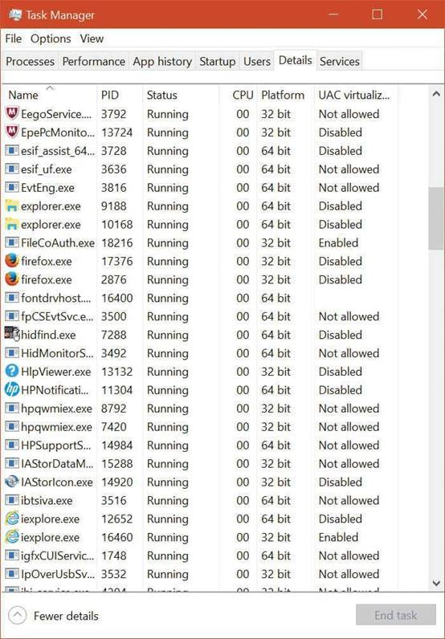 

**图 7-22** 使用任务管理器来查看虚拟化状态。除了文件系统和注册表的虚拟化，一些应用程序需要额外的帮助才能在标准用户权限下正确运行。例如，一个测试它所运行的账户是否属于 Administrators 组的应用程序在其他情况下可能会运行，但如果它不在该组中，它就不会运行。

Windows定义了一些应用程序的兼容性垫片，以使这些应用程序能够正常运行。表 7-15 显示了最常应用于标准用户权限操作的遗留应用程序的垫片。

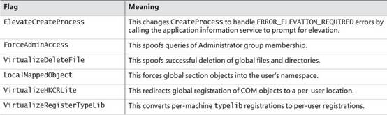 

**表 7-15** UAC 虚拟化垫片 

#### 7.9.1.1 文件虚拟化(File virtualzation) 

对遗留进程进行虚拟化的文件系统位置是%ProgramFiles%、%ProgramData%和%SystemRoot%，不包括一些特定的子目录。然而，任何带有可执行扩展名的文件--包括.exe、.bat、.scr、.vbs 和其他--都被排除在虚拟化之外。这意味着，从标准用户账户进行自我更新的程序会失败，而不是创建其可执行文件的私有版本，这些版本对于运行全局更新程序的管理员来说是不可见的。 

------

💬Note

要将扩展程序添加到例外列表中，在HKLM\System\Current-ControlSet\Services\Luafv\Parameters\Ex cludedExtensionsAdd 注册表键中输入它们，然后重新启动。使用多线类型来限定多个扩展，并且不要在扩展名称中包括一个前导点。

------

传统进程对虚拟化目录的修改被重定向到用户的虚拟根目录，%LocalAppData%/VirtualStore。路径中的本地组件强调了这样一个事实：当账户有一个漫游配置文件时，虚拟化的文件不会与配置文件的其他部分一起漫游。

UAC 文件虚拟化过滤驱动（%SystemRoot%\System32\Drivers\Luafv.sys）实现了文件系统的虚拟化。因为这是一个文件系统过滤驱动，它可以看到所有本地文件系统的操作，但它只对来自传统进程的操作实现功能。如图 7-23 所示，对于在系统全局位置创建文件的传统进程，过滤驱动会改变目标文件路径，但对于具有标准用户权限的非虚拟化进程则不会。\Windows 目录上的默认权限拒绝访问用 UAC 支持编写的应用程序，但遗留进程表现得好像操作成功了，而它实际上是在一个用户完全可以访问的位置创建了文件。 

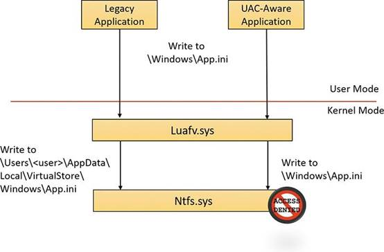 

图 **7-23** UAC 文件虚拟化过滤器驱动程序操作。  

#### 7.9.1.2 注册表虚拟化(Registry virtualization) 

注册表虚拟化的实现方式与文件系统虚拟化略有不同。虚拟化的注册表键包括

HKEY_LOCAL_MACHINE/Software 分支中的大部分，但也有许多例外情况，如以下。 

- HKLM\Software\MicrosoftWindows

- HKLM\Software\MicrosoftWindows NT 

- HKLM\Software\Classes 


只有那些经常被遗留应用程序修改，但不会带来兼容性或互操作性问题的键被虚拟化。Windows 将遗留应用程序对虚拟化键的修改重定向到用户的注册表虚拟根 HKEY_CURRENT_USER/Software/Classes/VirtualStore。该键位于用户的Classes hive 中，%LocalAppData%\Microsoft\Windows\UsrClass.dat，和其他虚拟文件数据一样，它不随漫游的用户配置文件漫游。与 Windows 为文件系统维护一个固定的虚拟化位置列表不同，一个键的虚拟化状态被存储为一个标志的组合，如表 7-16 所示。

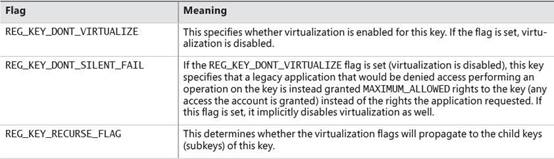 

**表 7-16** 注册表的虚拟化标志

你可以使用 Windows 中包含的 Reg.exe 工具，使用 flagsoption 来显示某个键的当前虚拟化状态或对其进行设置。在图 7-24 中，注意 HKLM\Software 键是完全虚拟化的，但 Windows 子键（和它的所有子键）只启用了沉默故障。 

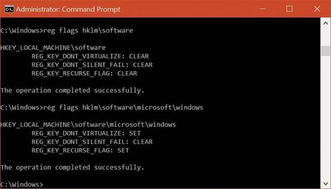 

图 **7-24** 软件和 Windows 键上的 UAC 注册表虚拟化标志。 

与使用过滤器驱动程序的文件虚拟化不同，注册表虚拟化是在配置管理器中实现的。(关于注册表和配置管理器的更多信息，请参见第 2 部分的第 9 章）。) 与文件系统虚拟化一样，创建虚拟化键的子键的传统进程被重定向到用户的注册表虚拟根，但与 UAC 兼容的进程被默认权限拒绝访问。这在图 7-25 中显示。 

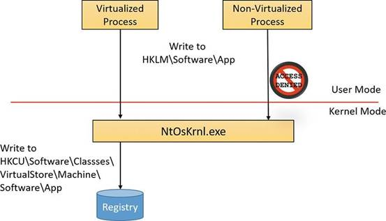 

**图 7-25** UAC 注册表的虚拟化操作。 

### 7.9.2 Elevation

即使用户只运行与标准用户权限兼容的程序，一些操作仍然需要管理权限。例如，绝大多数软件的安装都需要管理权限，以便在系统全局位置创建目录和注册表键，或者安装服务或设备驱动程序。修改系统-全局的 Windows 和应用程序设置也需要管理权限，家长控制功能也是如此。通过切换到一个专门的管理员账户来执行这些操作是可能的，但这样做的不便可能会导致大多数用户仍然使用管理员账户来执行他们的日常任务，其中大多数不需要管理权限。重要的是要意识到，UAC 的提升是方便的，而不是安全边界。安全边界要求安全策略规定什么可以通过边界。用户账户是 Windows 中安全边界的一个例子，因为一个用户如果没有得到另一个用户的许可，就不能访问属于该用户的数据。 

因为提升不是安全边界，所以不能保证在一个具有标准用户权限的系统上运行的恶意软件不能破坏提升的进程以获得管理权限。例如，提升对话框只确定了将被提升的可执行文件；它们没有说它执行时将做什么。

#### 7.9.2.1 以管理权限运行(Runing with administrative rights) 

Windows 包括增强的 "运行为 "功能，以便标准用户可以方便地启动具有管理权限的进程。这种功能要求给应用程序提供一种方法，以确定系统可以在必要时代表应用程序获得管理权限的操作（我们很快会就这个主题说更多）。

为了使作为系统管理员的用户能够以标准的用户权限运行，但在每次要访问管理权限时不必输入用户名和密码，Windows 使用了一种称为管理审批模式（AAM）的机制。该功能在登录时为用户创建两个身份：一个具有标准用户权限，另一个具有管理权限。由于 Windows 系统中的每个用户都是标准用户，或者在 AAM 中大部分时间都是以标准用户的身份行事，所以开发者必须假设所有的 Windows 用户都是标准用户，这将导致更多的程序在没有虚拟化或垫片的情况下以标准用户权限工作。 

向一个进程授予管理权限被称为提升。当提升由标准用户账户（或由属于管理组但不是实际的 Administrators 组的用户）执行时，它被称为越肩（OTS）提升，因为它需要输入作为 Administrators 组成员的账户的凭证，这通常由特权用户在标准用户的肩膀上打字完成。由 AAM 用户执行的提升被称为同意提升，因为该用户只需批准其管理权限的分配。 

单机系统（通常是家用电脑）和连接域的系统对远程用户的 AAM 访问的处理方式不同，因为连接域的电脑可以在其资源权限中使用域管理组。当一个用户访问单机计算机的文件共享时，Windows 会请求远程用户的标准用户身份。但在域连接的系统上，Windows 通过请求用户的管理身份来尊重所有用户的域组成员资格。执行请求管理权限的映像会导致应用信息服务（AIS，包含在%SystemRoot%System32\Appinfo.dll 中），它在标准服务主机进程（SvcHost.exe）中运行，启动%SystemRoot%\System32\Consent.exe。同意 "捕获屏幕的位图，对其施加淡化效果，切换到只有本地系统账户才能访问的桌面（安全桌面），将位图绘制成背景，并显示一个包含可执行文件信息的提升对话框。在一个单独的桌面上显示这个对话框可以防止用户账户中存在的任何应用程序修改对话框的外观。

如果一个图像是经过数字签名的 Windows 组件（由微软或其他实体），对话框顶部会显示一条浅蓝色的条纹，如图 7-26 左侧所示（在 Windows 10 中已经删除了微软签名的图像和其他签名者之间的区别）。如果图像没有签名，条纹会变成黄色，并且提示强调图像的未知来源（见图 7-26 的右边）。提升对话框显示图像的图标、描述和数字签名图像的发布者，但它只显示文件名和 "发布者。未签署的图像则只显示文件名和 "未知"。这种差异使恶意软件更难模仿合法软件的外观。对话框底部的 "显示更多细节 "链接将其展开，以显示启动时将传递给可执行文件的命令行。

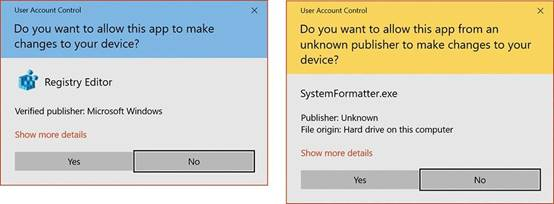 

**图 7-26** 基于图像签名的 AAC UAC 提升对话框。 

OTS 同意对话框，如图 7-27 所示，与此类似，但提示需要管理员凭证。它

将列出任何具有管理员权限的账户。 

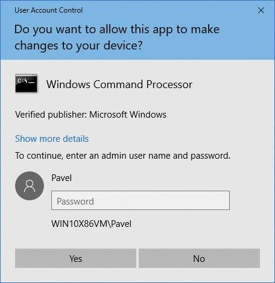 

**图 7-27** OTS 同意对话框。 

如果用户拒绝提升，Windows 会向启动该进程的程序返回一个访问拒绝的错误。当用户通过输入管理员凭证或点击 "是 "同意提升时，AIS 调用CreateProcessAsUser 来启动具有适当管理身份的进程。尽管 AIS 在技术上是被提升的进程的父进程，但 AIS 在 CreateProcessAsUser API 中使用新的支持，将进程的父进程 ID 设置为最初启动它的进程的 ID。这就是为什么在显示进程树的工具（如 Process Explorer）中，提升的进程不会作为 AIS 服务托管进程的子进程出现。图 7-28 显示了从一个标准用户帐户启动一个提升的进程所涉及的操作。

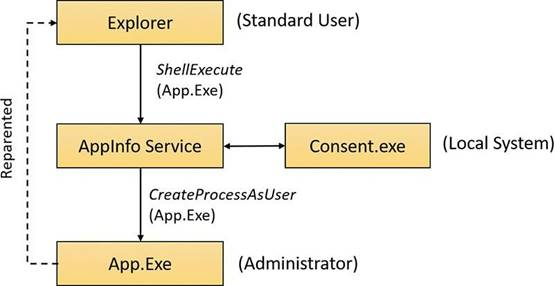 

**图 7-28** 以标准用户身份启动一个管理应用程序。

#### 7.9.2.2 申请管理权(Requesting administrative rights)

系统和应用程序有多种方式来识别对管理权限的需求。在资源管理器的用户界面上显示的一个是以管理员身份运行的上下文菜单命令和快捷方式选项。这些项目还包括一个蓝色和金色的盾牌图标，应该放在任何按钮或菜单项目旁边，当它被选中时，会导致权利的提升。选择 "以管理员身份运行 "命令会使资源管理器用 runas 动词调用 ShellExecute API。 

绝大多数安装程序需要管理权限，所以启动可执行文件的图像加载器包括安装程序检测代码，以识别可能的遗留安装程序。它使用的一些启发式方法很简单，如检测内部版本信息或图像的文件名中是否有setup、install或update字样。更复杂的检测手段包括扫描可执行文件中的字节序列，这些字节序列是第三方安装包装工具所共有的。镜像加载器还调用应用程序兼容性库来查看目标可执行文件是否需要管理员权限。该库在应用程序兼容性数据库中查看该可执行文件是否有 RequireAdministrator 或 RunAsInvoker 兼容性标志与之相关。

可执行文件请求管理权限的最常见方式是在其应用程序清单文件中包含一个requestedExecutionLevel 标签。该元素的级别属性可以有表 7-17 中所示的三个值之一。 

 

**表 7-17** 

清单中出现 trustInfo 元素（您可以在 eventvwr.exe 的清单转储中看到）表示编写的可执行文件支持 UAC， requestedExecutionLevel 元素嵌套其中。uiAccess 属性是无障碍应用程序可以使用前面提到的 UIPI 绕过功能的地方。 

```
C:\>sigcheck -m c:\Windows\System32\eventvwr.exe.. 

.<trustInfo xmlns="urn:schemas-microsoft-com:asm.v3"> < security> 

<requestedPrivileges> 

<requestedExecutionLevel level 

="highestAvailable" 

uiAccess="false" 

/> 

</requestedPrivileges> </ security> </trustInfo> < asmv3:application>  <asmv3:windowsSettings xmlns="http://schemas.microsoft.com/SMI/2005/WindowsSettings"> 

<autoElevate>true</autoElevate> </asmv3:windowsSettings> </asmv3: application>. 


```

#### 7.9.2.3 Auto-elevation

在默认配置下（见下一节，了解有关改变的信息），大多数 Windows 可执行文件和控制面板小程序不会导致管理用户的提升提示，即使它们需要管理权限才能运行。这是因为有一种叫做自动提升的机制。自动提升的目的是防止管理用户在大多数工作中看到提升提示；这些程序将自动在用户的完整管理权限下运行。

Auto-elecation有几个要求。其一是有关的可执行文件必须被认为是 Windows 可执行文件。这意味着它必须由 Windows 出版商签署（而不仅仅是微软；奇怪的是，它们并不一样--Windows 签署的被认为比微软签署的更有特权）。它还必须在几个被认为是安全的目录之一：%SystemRoot%\System32 及其大多数子目录%Systemroot%\Ehome，以及%ProgramFiles%下的少量目录（例如，包含 Windows Defender 和 Windows Journal 的目录）。

 根据可执行文件的类型，还有一些额外的要求。除 Mmc.exe 之外的其他 EXE 文件，如果通过其清单中的 autoElevate 元素请求，则会自动升空。前面一节中显示的 eventvwr.exe 的清单说明了这一点。 

Mmc.exe 被视为一个特殊的例子，因为它是否应该自动升空取决于它要加载哪些系统管理快照。Mmc.exe 通常是通过一个指定 MSC 文件的命令行来调用的，而这个文件又指定了要加载哪些快照。当 Mmc.exe 从一个受保护的管理员账户（使用有限的管理员令牌运行的账户）运行时，它会要求 Windows 给予管理权限。Windows 会验证 Mmc.exe 是一个 Windows 可执行文件，然后检查 MSC。该 MSC 也必须通过 Windows 可执行文件的测试，而且必须在一个自动提升 MSC 的内部列表中。这个列表包括 Windows 中几乎所有的 MSC 文件。 

最后，COM（进程外服务器）类可以在其注册表键中申请管理权限。这样做需要一个名为 "提升 "的子键，其 DWORD 值名为 "启用"，其值为 1。COM 类和其实例化的可执行文件都必须满足 Windows 可执行文件的要求，尽管可执行文件不需要请求自动提升。

#### 7.9.2.4 控制UAC行为(Controlling UAC behavior)

UAC 可以通过图 7-29 所示的对话框进行修改。这个对话框在 "更改用户账户控制设置 "下可用。图 7-29 显示了控制在其默认位置。 

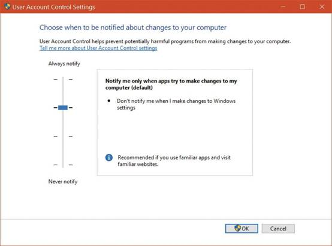 

**图 7-29** 用户账户控制设置对话框。

四种可能的设置具有表 7-18 中描述的效果。 

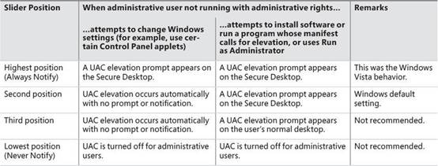 

**表 7-18** UAC 选项 

不建议使用第三个位置，因为 UAC 提升提示不是出现在安全桌面上，而是出现在普通用户的桌面上。这可能允许在同一会话中运行的恶意程序改变提示的外观。它只适用于视频子系统需要很长时间来调亮桌面或不适合通常 UAC 显示的系统。 

强烈不建议使用最低位置，因为就管理账户而言，它完全关闭了 UAC。一个拥有管理账户的用户所运行的所有进程将以该用户的全部管理权限运行；没有过滤的管理令牌。这些账户的注册表和文件系统的虚拟化也被禁用，Internet 

Explorer 的保护模式也被禁用。然而，虚拟化对非管理员账户仍然有效，当非管理员账户试图改变 Windows 设置，运行需要提升的程序，或使用资源管理器中的运行为管理员上下文菜单选项时，仍然会看到 OTS 提升的提示。 

UAC 设置存储在注册表HKLM\SOFTWARE\Microsoft\Windows\CurrentVersion\Policies\System 下的四个值中，如表 7-19 所示。ConsentPromptBehaviorAdmin 控制使用过滤的管理员令牌运行的 UAC 提升提示，ConsentPromptBehaviorUser 控制管理员以外的用户的 UAC 提示。 

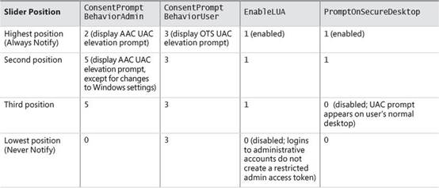 

**表 7-19** UAC 注册表的数值 

